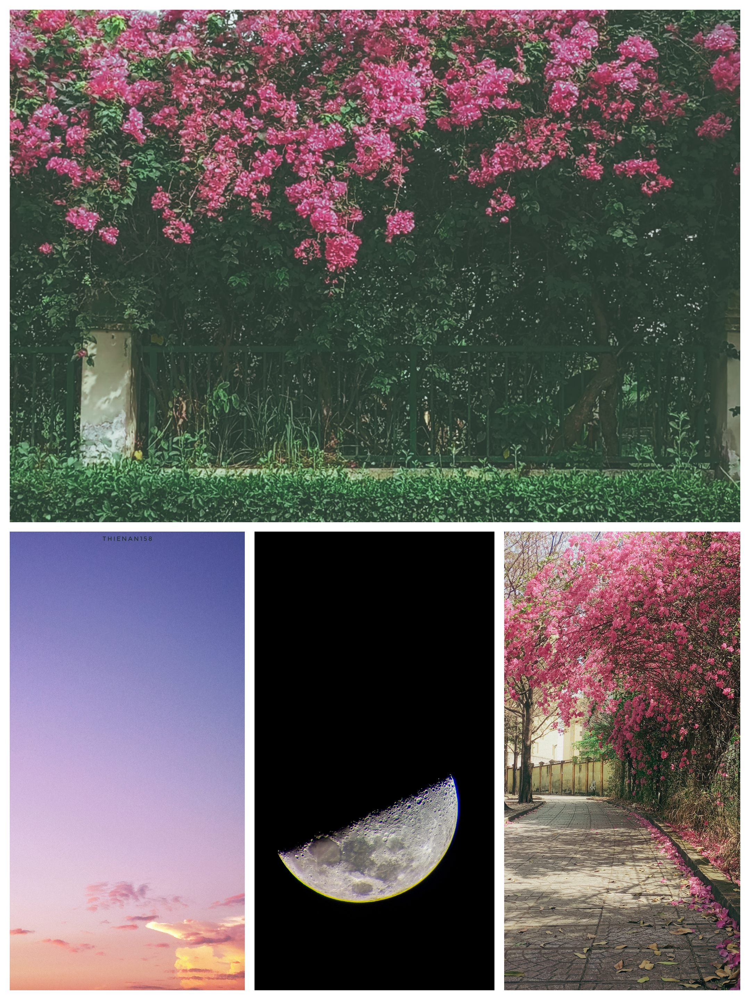

> **Phố trăm ngã ngập tràn hoa**  
> **Mình ta lê bước, bóng nhòa lối quen.**  
> **Mây hồng nhẹ bỗng cánh sen**  
> **Tiếng lòng trĩu nặng, tắt đèn tìm trăng.**  
> **Tự tình họa nét thơ văn**  
> **Cho hoa không úa, cho trăng không tàn.**

---

Kẻ đi lang thang trong thành phố tấp nập phồn hoa ấy, mang theo tấm lòng trĩu nặng suy tư nhưng đầy tâm tình ấy là ai?

Hà cớ gì lại từ chối những con đường hoa rực rỡ sắc màu để đi trên lối quen một mình?  
Những buổi hoàng hôn nên thơ, mây trôi dịu dàng như cánh sen sao lại có vẻ như áp lực nặng nề lên người kẻ đó?  
Và có ai như kẻ ấy lại tắt đi những ánh đèn điện sáng bưng để tìm ánh trăng xa xôi dịu vợi?  
Tình cảm kẻ ấy giàu có đến đâu mà đem ra họa trăng hoa, ca thơ văn để giữ lại nét đẹp mỹ miều của thiên nhiên này?

Là gã điên hay kẻ khờ?  
Là một thi sĩ hay gã bợm rượu?

<!-- truncate -->

**Rốt cuộc kẻ đó là ai?**  
**Đúng rồi, là tôi đó — kẻ cô đơn trong thành phố này.**

Tôi không ghét gì thành phố này, lại càng chẳng ghét trăng hoa, mây trời — mà còn yêu chúng rất nhiều.  
Vì tôi là một **kẻ mộng mơ** mà.

Chỉ là, trong lòng tôi luôn âm ỉ nỗi cô đơn mà ngay cả những người tôi yêu cũng khó lòng giúp tôi gạt bỏ đi được.

> Đôi lúc tôi coi nó như **căn bệnh**, cố tìm mọi cách để loại bỏ.  
> Nhưng cũng có lúc như một **người tri kỷ** để chia sẻ mọi tâm sự mà tôi khó nói thành lời.

Tôi cũng quen với nỗi cô đơn đó, và **chọn sống cùng nó như một chiếc áo khoác** — một lựa chọn cho vẻ ngoài của tôi.  
Mỗi khi khoác lên mình nỗi cô đơn, tôi sẽ không buồn không vui, không màng đến thế sự gì nữa.

---

- **Chỉ là** không hứng thú với chốn đô thị phồn hoa nên tìm về lối xưa ôn lại kỷ niệm cũ;
- **Chỉ là** những buổi hoàng hôn quá đỗi dịu dàng lại càng làm lòng tôi trĩu nặng những câu hỏi tự ti, tự trách cùng với những tâm tình từ trước đến nay;
- **Chỉ là** thích ôn lại kỷ niệm, hay nhìn về quá khứ nên rời xa thực tại mà sống trong ký ức;
- **Chỉ là** tự hóa thành thi sĩ họa vào quyển sách đời mình một nét thơ văn cho bớt tẻ nhạt, cho vơi đi nỗi sầu và tiếc nuối day dứt một đời;
- **Chỉ là** tôi biết mình không thuộc về thế giới này — cảnh sắc hùng vĩ, thơ mộng, choáng ngợp đến đâu cũng không dành cho tôi.

Tôi chỉ có thể tự dùng tình cảm của mình vẽ ra nó — **một thế giới dành cho kẻ cô đơn.**
