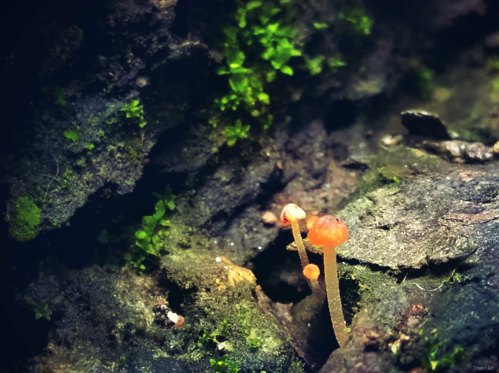
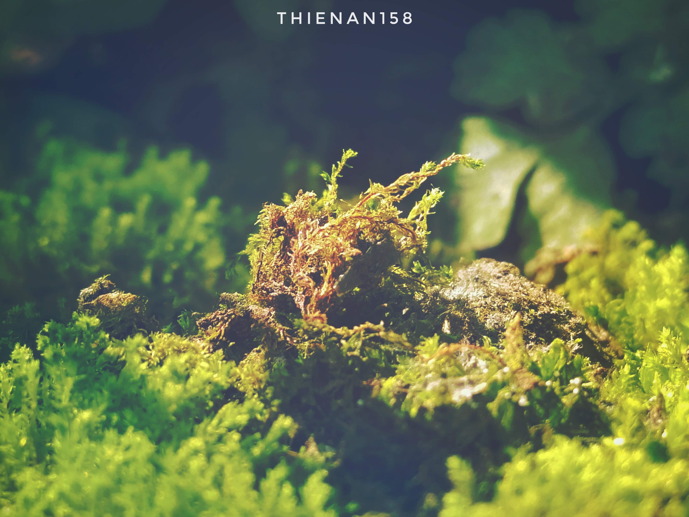

> "Phía trên tán cây kia có gì nhỉ?" - tôi tự hỏi.

Một ngày mới bắt đầu, tôi lại nhìn xung quanh.

Có rất nhiều nhánh rêu giống như tôi, đều đều một màu xanh mơn mởn và kích thước be bé. Còn có rất nhiều loại nấm nhỏ và cỏ dại, với nhiều màu sắc, hình dáng và kích thước. Chúng tôi là những cư dân tầng thấp nhất của thảm thực vật.

---

<!-- truncate -->

Tôi là **cây rêu nhỏ**, vì mọi người bảo thế.

Tôi nằm dưới một gốc cây khổng lồ, tán cây rộng khắp khỏi tầm mắt tôi tạo nên môi trường ẩm thấp và mát mẻ. Tôi không biết tại sao mình ở đây, cũng không biết mình sống để làm gì. Cứ từng ngày trôi qua, quang hợp và chờ đợi những cơn mưa. Tôi không vui không buồn, chỉ chấp nhận cuộc sống hiện tại.

> "Phải tránh đi ánh nắng, vì nếu tiếp xúc trực tiếp với ánh nắng thời gian dài, chúng ta sẽ chết." \
> \
> "Rêu không có hạt và hoa, chỉ có bào tử thể mà thôi."

Tôi đã tin như thế, tin vào những gì mọi người nói.

Khi thấy những cây nấm cao lớn với sắc màu rực rỡ đang tắm mình dưới nắng, tôi không khỏi ngưỡng mộ. Tôi cũng muốn được như họ, nhưng những luật cấm đã kìm hãm tôi lại, thân phận thấp bé này chỉ biết làm nền cho sự đẹp đẽ ấy.

.jpg>)

Tôi ngước đầu lên nhìn và vẫn thấy tán cây cao to kia, tự hỏi trên những tán cây ấy có gì, có rêu phong giống chúng tôi hay những cây nấm kia không? Có những nàng "Hoa" kiều diễm mọi người vẫn thường đồn thổi không? Có nhiều thắc mắc trong tôi nhưng tôi không dám nói với mọi người, vì sợ mọi người sẽ cười nhạo và xa lánh tôi, dẫu sao thì tôi cũng không với tới được.

---

Suốt những ngày mưa tôi cứ sống như thế, như một cây rêu nhỏ. Cho đến một ngày, những cơn mưa đã ngơi dần và cây bắt đầu rụng lá. Tán cây thưa dần để lộ những tia sáng tiến vào tầng lớp thấp của chúng tôi. Nhìn những cư dân kia đang dần héo mòn, tôi cũng chỉ biết chấp nhận số phận và đợi chờ cái kết giống như họ.

> "Ánh sáng đã lan tới rồi, thật ấm áp và dễ chịu làm sao-" \
> "Hả? Khoan, "ấm áp và dễ chịu" là gì cơ?"

Tôi không nhớ mình đã học những từ này, với lại sao tôi vẫn còn sống?

Tôi hoang mang, nhìn xung quanh và thấy những cư dân Rêu khác đã không còn bên cạnh, chỉ còn mình tôi. Còn chưa kịp buồn vì giờ đã trở thành người cô đơn, tôi nhận ra mình đã có lá mầm lúc nào không hay. Lại một kiến thức mới được thêm vào, lá mầm. Cố gắng bình tĩnh và suy nghĩ, tôi tự hỏi mọi thay đổi có phải đều do ánh nắng ấy mang lại?

Dẫu không biết tốt hay xấu nhưng hiện tại tôi không có gì đau đớn hay khó chịu.

Thử cử động lá mầm mình vừa có được, cảm giác mới lạ lan khắp cơ thể tôi, tôi học được đó là căng tràn sức sống. Tiếp đó là cảm giác mạnh mẽ và tự tin khiến khóe miệng tôi cong lên.

Giờ tôi đã cảm nhận được từng cơn gió mát lành và dễ chịu đang lướt qua, cảm nhận được sự ấm áp của ánh nắng mà ban nãy mình còn sợ hãi. Để cảm ơn cho sự đổi mới này, tôi dang rộng hai lá mầm của mình để đón nhận thật nhiều ánh nắng.

Ánh nắng dạy cho tôi nhiều bài học mới, quan trọng nhất là "người ấy" đã giúp tôi biết được, tôi không phải rêu, mà là một mầm non đang chờ ngày đâm chồi, bén rễ.

Tôi đã nghĩ ánh nắng thật tuyệt và mong rằng sẽ không bao giờ mất đi "người ấy", nhưng ánh nắng ngày càng tỏa sáng và nóng bỏng hơn, khiến tôi héo mòn và sợ hãi, cuối cùng lại tự mình tránh đi ánh nắng.

Trong bóng tối ẩm thấp và có chút lạnh lẽo, tôi bỗng nhớ về những ngày bên cạnh cư dân Rêu. Dẫu họ không xấu nhưng họ đã định nghĩa con người tôi khiến tôi không phát triển được, nhờ có ánh nắng mà tôi mới tự mình tư duy và phát triển.

Tôi muốn gặp lại ánh nắng, tôi nhớ cảm giác ấm áp "người ấy" mang lại, nhưng tôi lo sợ mình sẽ lại héo mòn.

Tôi cố gắng tìm cách và nhận ra mình có thể phát triển rễ để tìm nước, thế là dốc sức phát triển rễ và tìm được nguồn nước mát lành, dịu ngọt. Lá đã xanh trở lại, tôi lại vươn mình ra tìm ánh nắng, không còn sợ ánh nắng gay gắt nữa.

Càng vươn xa tôi lại biết được nhiều thứ hơn, lại càng muốn vươn xa hơn nữa. Trong hành trình ấy, tôi đã trải qua nhiều ánh nắng khác nhau, có ánh nắng ấm áp của bình minh và hoàng hôn, có ánh nắng le lói của những bầu trời đầy sương, có ánh nắng nóng bỏng của những buổi trưa hè,... Tất cả đều mang nét riêng và tuyệt đẹp, họ đã giúp tôi trưởng thành qua những tháng năm dài đằng đẵng.

Giờ tôi đã có tán cây tạo nên bóng mát cho những tầng lớp dưới, câu hỏi lúc trước đã có câu trả lời rồi.

"Phía trên tán cây là sự trưởng thành và ý chí phát triển không ngừng."

---

Chú thích:

- Rêu: Bản thân tôi 4 năm trước.
- Nấm: Người tôi từng ngưỡng mộ.
- Ánh nắng lúc đầu: Anh sáng tri thức.
- Ánh nắng lúc sau: Người tôi thương.
- Những ánh nắng khác: Những người luôn động viên và an ủi tôi.
- Nguồn nước: Gia đình, thế giới quan và những người tôi tin tưởng.
