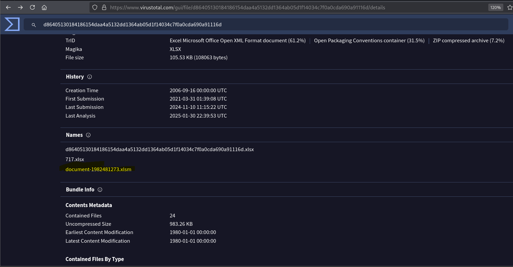

Ehe, nay tôi và cậu ấy làm bài lab nhỏ để không bị nhồi lý thuyết quá nhìu :3 sẵn tiện ôn lại Threat Intel skill lun nha. Bài [IcedID](https://cyberdefenders.org/blueteam-ctf-challenges/icedid/) này ở mức dễ và cũng có hướng dẫn rồi nha, mọi người nên xem qua hướng dẫn để có nhiều thông tin và chính xác hơn :v. Của tôi và cậu ấy cũng chỉ là ghi lại quá trình làm thôi à...

## Ngữ cảnh

Một nhóm tác nhân đe dọa mạng được xác định là đã bắt đầu các chiến dịch lừa đảo rộng rãi để phân phối payload độc hại. Các payload thường gặp nhất là Icedid. Bạn đã được cung cấp một giá trị băm của một mẫu Icedid để phân tích và theo dõi các hoạt động của nhóm tác nhân đe dọa lâu dài có chủ đích (APT - advanced persistent threat) này.

## Công cụ sử dụng

- [Virus Total](https://www.virustotal.com/gui/home/upload): Virus Total là một dịch vụ miễn phí cung cấp khả năng phân tích các tệp, địa chỉ IP, URL, hash và tên miền để phát hiện mã độc hoặc các lỗ hổng.
- [Malpedia](https://malpedia.caad.fkie.fraunhofer.de/?form=MG0AV3): Malpedia là một dịch vụ miễn phí do Fraunhofer FKIE cung cấp, nhằm cung cấp tài nguyên để nhanh chóng xác định bối cảnh và hành động khi điều tra mã độc.
- [MITRE ATT&CK](https://attack.mitre.org/): MITRE ATT&CK là một bộ kiến thức toàn cầu về hành vi của kẻ tấn công mạng. Nó cung cấp một cơ sở dữ liệu về các chiến thuật, kỹ thuật và quy trình thường được sử dụng bởi các kẻ tấn công

## Quá trình phân tích

### Q1: Tên của tệp được liên kết với chuỗi hash đã cho là gì?

| Trả lời | document-1982481273.xlsm |
| ------- | ------------------------ |

- **Tìm cái gì:** Tên của file liên quan đến chuỗi hash.
- **Tìm ở đâu:** VirusTotal hoặc các công cụ khác hỗ trợ search bằng hash.
- **Tìm thế nào:** Truy cập VirusTotal và paste giá trị hash vào.

### Q2: Bạn có thể xác định tên của tệp GIF đã được triển khai không?

| Trả lời | 3003.gif |
| ------- | -------- |

- **Tìm cái gì:** Tên của tệp GIF độc hại.
- **Tìm ở đâu:** VirusTotal hoặc các công cụ khác tương tự.
- **Tìm thế nào:** Chuyển sang tab Relations và xem ở phần Connected URLs.

.png>)

### Q3: Phần mềm độc hại tìm kiếm bao nhiêu tên miền để tải xuống payload bổ trợ trong Q2?

| Trả lời | 5   |
| ------- | --- |

- **Tìm cái gì:** Số lượng Domain dùng để tải 3003.gif.
- **Tìm ở đâu:** VirusTotal hoặc các công cụ khác tương tự.
- **Tìm thế nào:** Chuyển sang tab Relations và xem ở phần Connected URLs, đếm số lượng URL có truy cập tới 3003.gif.

.png>)

### Q4: Từ các tên miền được đề cập trong Q3, Nhà đăng ký DNS nào chủ yếu được sử dụng bởi tác nhân đe dọa để lưu trữ nội dung có hại của họ?

| Trả lời | NAMECHEAP |
| ------- | --------- |

- **Tìm cái gì:** Tên của nhà đăng ký DNS.
- **Tìm ở đâu:** VirusTotal hoặc các công cụ khác tương tự.
- **Tìm thế nào:** Chuyển sang tab Relations và xem ở phần Contacted Domain, tính tổng số Detections của mỗi nhà đăng ký để xem đâu là nhà đăng ký được dùng nhiều nhất.

.png>)

### Q5: Bạn có thể chỉ định tác nhân đe dọa được liên kết với mẫu được cung cấp không?

| Trả lời | GOLD CABIN |
| ------- | ---------- |

- **Tìm cái gì:** Tên các tác nhân đe dọa có liên quan.
- **Tìm ở đâu:** MITRE ATT&CK.
- **Tìm thế nào:** Các Threat intelligence repositories như MITRE ATT&CK được tư vấn để xác định diễn viên đe dọa liên quan đến mẫu Icedid này. Kết quả cho thấy một groups có tên là GOLD CABIN hay TA551 có sử dụng payload này.

.png>)
.png>)

### Q6: Trong giai đoạn thực thi, phần mềm độc hại sử dụng chức năng nào để tải thêm payload về hệ thống?

| Trả lời | URLDownloadToFileA |
| ------- | ------------------ |

- **Tìm cái gì:** Tên của chức năng được sử dụng để tải payload.
- **Tìm ở đâu:** Recorded Future Triage.
- **Tìm thế nào:** Câu này mình xem hướng dẫn chứ không mò được :b
