Tiếp nối bài thử nghiệm khả năng phát hiện malware của ClamAV lần trước, bài này trình bày chi tiết về cách cấu hình và sử dụng ClamAV để quét **thời gian thực** trên Linux và quét **tự động** trên Windows.

---

## 1. Cấu hình và sử dụng trên Kali Linux

### 1.1. Quản lý services và cấu hình

Sau khi cài đặt ClamAV, sẽ có ba dịch vụ chính phục vụ cho cả cập nhật database, quét theo yêu cầu và quét thời gian thực:

```bash
sudo systemctl status clamav-freshclam.service    # cập nhật signature DB
sudo systemctl status clamav-daemon.service       # dịch vụ quét nền
sudo systemctl status clamav-onacc.service        # quét thời gian thực
```

Trước khi chỉnh sửa, hãy backup hai file cấu hình quan trọng:

```bash
sudo cp /etc/clamav/clamd.conf ~/clamav-config-backup/
sudo cp /etc/systemd/system/clamav-onacc.service ~/clamav-config-backup/
```

- **`/etc/clamav/clamd.conf`**: Cấu hình ClamD (daemon quét nền).
- **`/etc/systemd/system/clamav-onacc.service`**: Cấu hình dịch vụ On-Access Scanning.

### 1.2. Quét theo yêu cầu (On-Demand Scan)

Lệnh quét cơ bản:

```bash
clamscan [options] [file|directory|-]
```

Ví dụ minh họa các nhóm tùy chọn:  
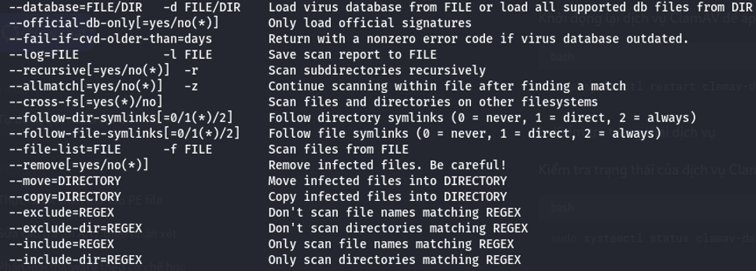  
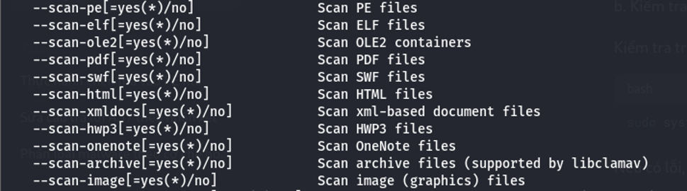  
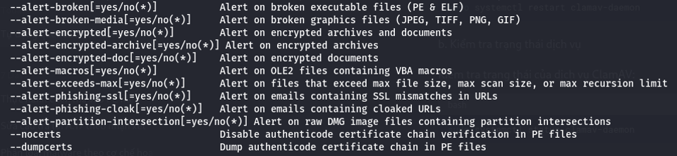

Và ví dụ thực thi:

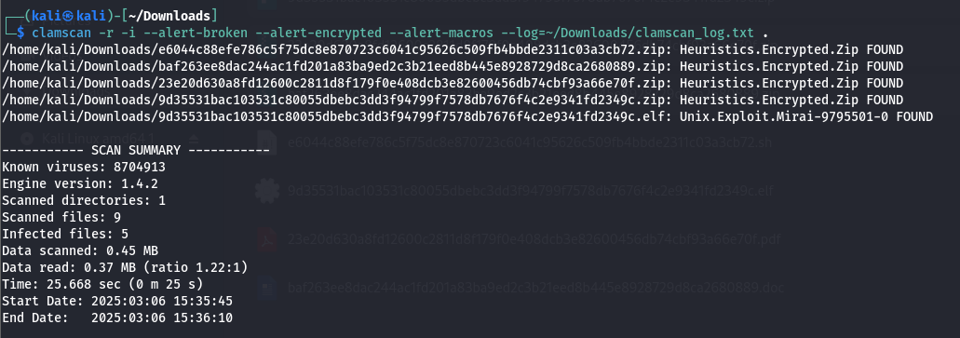

### 1.3. Quét thời gian thực (On-Access Scanning)

> **Lưu ý**: Tính năng chỉ hỗ trợ Linux với kernel có **fanotify** enabled.

1. Kiểm tra fanotify:

   ```bash
   grep FANOTIFY /boot/config-$(uname -r)
   ```

   - `CONFIG_FANOTIFY=y`
   - `CONFIG_FANOTIFY_ACCESS_PERMISSIONS=y`

2. Cấu hình `/etc/clamav/clamd.conf`:  
   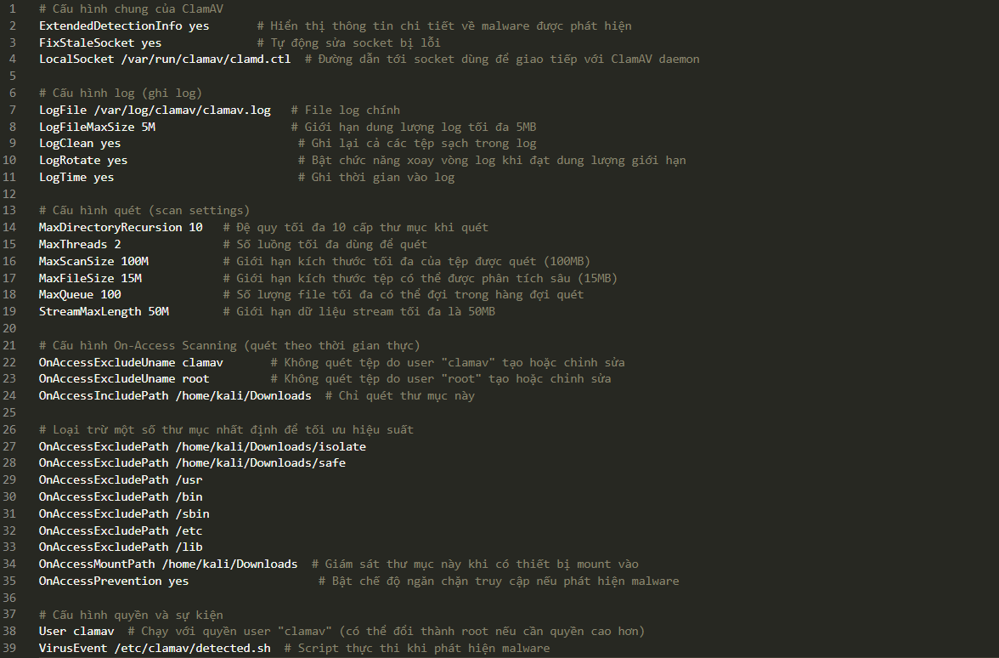

3. Script thông báo thay thế (`/etc/clamav/detected.sh`):

   ```bash
    #!/bin/bash

    export LOG="/var/log/clamav/scan.log"
    export TARGET="/"
    export SUMMARY_FILE=`mktemp`

    export SCAN_STATUS
    export INFECTED_SUMMARY
    export XUSERS

    echo "------------ SCAN START ------------" >> "$LOG"
    echo "Running scan on `date`" >> "$LOG"

    sudo clamdscan --log "$LOG" --infected --multiscan --fdpass "$TARGET" > "$SUMMARY_FILE"

    SCAN_STATUS="$?"
    INFECTED_SUMMARY=`cat $SUMMARY_FILE | grep Infected`
    rm "$SUMMARY_FILE"

    if [[ "$SCAN_STATUS" -ne "0" ]] ; then

      # Send the alert to systemd logger if exist
      if [[ -n $(command -v systemd-cat) ]] ; then
        echo "Virus signature found - $INFECTED_SUMMARY" | /usr/bin/systemd-cat -t clamav -p emerg
      fi

      # Send an alert to all graphical users.
      XUSERS=($(who|awk '{print $1$NF}'|sort -u))
      for XUSER in $XUSERS; do
        NAME=(${XUSER/(/ })
        DISPLAY=${NAME[1]/)/}
        DBUS_ADDRESS=unix:path=/run/user/$(id -u ${NAME[0]})/bus
        echo "run $NAME - $DISPLAY - $DBUS_ADDRESS -" >> /tmp/testlog
        /usr/bin/sudo -u ${NAME[0]} DISPLAY=${DISPLAY} \
          DBUS_SESSION_BUS_ADDRESS=${DBUS_ADDRESS} \
          PATH=${PATH} \
          /usr/bin/notify-send -i security-low "Virus signature(s) found" "$INFECTED_SUMMARY"
      done

    fi
   ```

   Cập nhật quyền thực thi cho script.

   ```bash
   sudo chmod +x /etc/clamav/detected.sh
   ```

4. Cấu hình service On-Access:  
   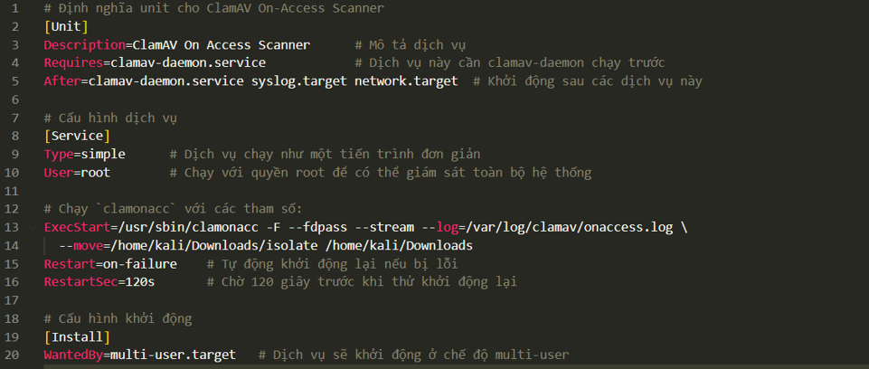

5. Khởi động và bật auto-start:

   ```bash
   sudo systemctl enable clamav-onacc.service
   sudo systemctl start clamav-onacc.service
   sudo systemctl status clamav-onacc.service
   ```

6. Theo dõi log realtime:

   ```bash
   tail -f /var/log/clamav/clamav.log
   # hoặc
   grep "FOUND" /var/log/clamav/clamav.log
   ```

   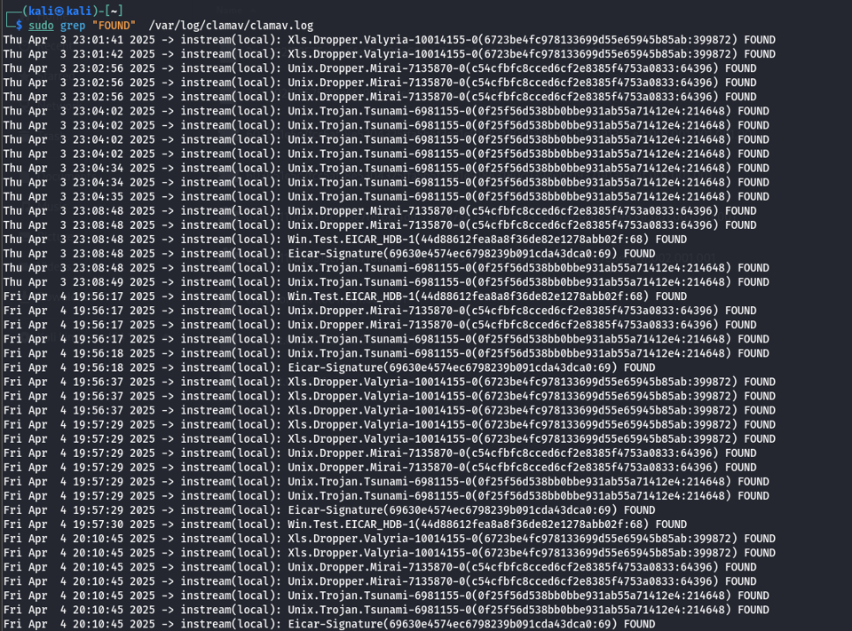

---

## 2. Cấu hình và sử dụng trên Windows

### 2.1. Quét tự động định kỳ (Scheduled Scan)

Tạo file batch `clamscan_daily.bat`:

```bat
@echo off
"C:\Program Files\ClamAV\clamscan.exe" --recursive --infected --log="C:\clamav_logs\scan_%date%.log" C:\Users
```

**Task Scheduler**:

1. **Create Basic Task** “Daily ClamAV Scan”
2. Triggers → **Daily** → chọn thời gian, lặp lại theo khoảng.
3. Actions → **Start a program** → trỏ tới `clamscan_daily.bat`.
4. Chạy thử:

   ```cmd
   schtasks /run /tn "Daily ClamAV Scan"
   ```

   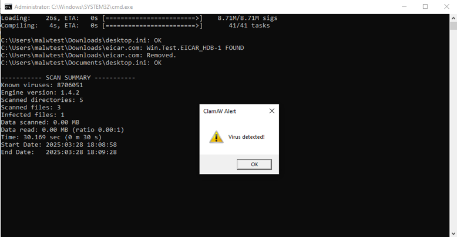  
   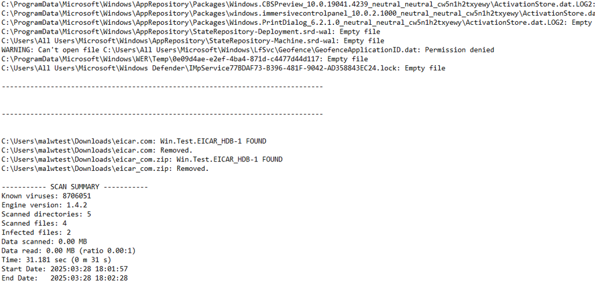

### 2.2. Quét USB tự động khi cắm

#### 2.2.1. Tạo PowerShell script & batch wrapper

**usb_scan.ps1** (English, no Unicode):

```powershell
# Load Windows Forms library
Add-Type -AssemblyName System.Windows.Forms

# Initialize log file
$logFile = "C:\clamav_logs\usb_scan.log"
$timestamp = Get-Date -Format "yyyy-MM-dd HH:mm:ss"
"====== Script started at $timestamp ======" | Out-File -Append $logFile

# Find USB drives
$usbDrives = Get-WmiObject Win32_LogicalDisk | Where-Object { $_.DriveType -eq 2 }

if ($usbDrives) {
    foreach ($drive in $usbDrives) {
        Write-Host "Detected USB Drive: $($drive.DeviceID)"
        ">> Scanning drive $($drive.DeviceID)" | Out-File -Append $logFile

        # Update virus database
        & "C:\Program Files\ClamAV\freshclam.exe" | Out-File -Append $logFile

        # Scan the USB drive
        $scanResult = Start-Process -FilePath "C:\Program Files\ClamAV\clamscan.exe" `
                                     -ArgumentList "--recursive --alert-broken --alert-encrypted --alert-macros --move=C:\Users\$env:USERNAME\Downloads\isolate --log=$logFile $($drive.DeviceID)\" `
                                     -Wait `
                                     -PassThru

        # Check the exit code
        if ($scanResult.ExitCode -eq 1) {
            [System.Windows.Forms.MessageBox]::Show("Virus detected on USB drive $($drive.DeviceID)! The drive will be unmounted!", "ClamAV Alert",
            [System.Windows.Forms.MessageBoxButtons]::OK, [System.Windows.Forms.MessageBoxIcon]::Warning)

            # Only if virus detected, then unmount the USB drive
            $volInfo = Get-CimInstance -ClassName Win32_Volume | Where-Object { $_.DriveLetter -eq $drive.DeviceID }
            if ($volInfo) {
                $guidPath = $volInfo.DeviceID
                Write-Host "Unmounting USB: $guidPath"
                "Unmounting USB: $guidPath" | Out-File -Append $logFile
                mountvol.exe $($drive.DeviceID) /d
            } else {
                Write-Host "Failed to find volume GUID to unmount."
                "Failed to find volume GUID to unmount." | Out-File -Append $logFile
            }
        } elseif ($scanResult.ExitCode -eq 0) {
            # USB clean, show info message
            [System.Windows.Forms.MessageBox]::Show("USB drive $($drive.DeviceID) is clean. You can use it safely.", "ClamAV Scan Result",
            [System.Windows.Forms.MessageBoxButtons]::OK, [System.Windows.Forms.MessageBoxIcon]::Information)
        }
    }
} else {
    Write-Host "No USB drive detected."
    "No USB drive detected." | Out-File -Append $logFile
}

# Script end
$timestamp = Get-Date -Format "yyyy-MM-dd HH:mm:ss"
"====== Script ended at $timestamp ======" | Out-File -Append $logFile
```

**usb_scan.bat**:

```bat
@echo off
powershell.exe -ExecutionPolicy Bypass -NoProfile -File "C:\Users\%USERNAME%\Desktop\usb_scan.ps1"
```

#### 2.2.2. Cấu hình Task Scheduler

1. **Create Task** → Name: “ClamAV USB Scan”
2. **General**: Run with highest privileges; Configure: Windows 10.
3. **Triggers**: On an event →
   - Log: `Microsoft-Windows-DeviceSetupManager/Admin`
   - Source: `Microsoft-Windows-DeviceSetupManager`
   - Event ID: `131`
4. **Actions**: Start a program → `usb_scan_safe.bat`.
5. **Conditions**: (tuỳ chọn) AC power only.
6. Kiểm tra kết quả:
   - USB clean: 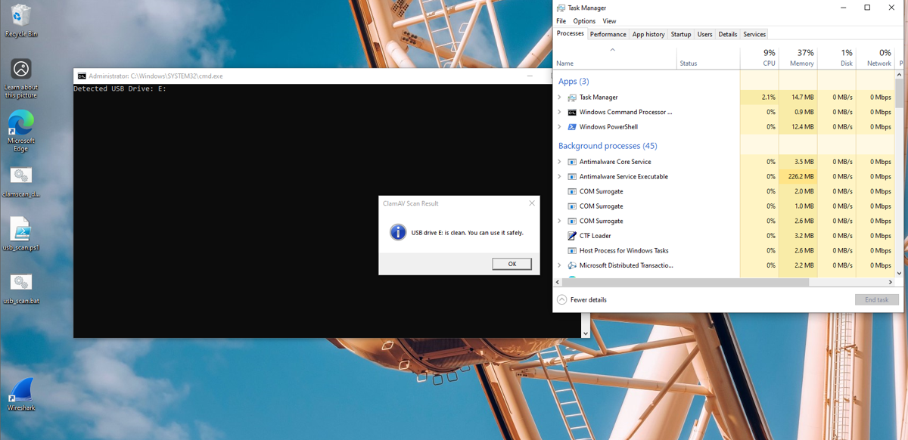
   - USB nhiễm: 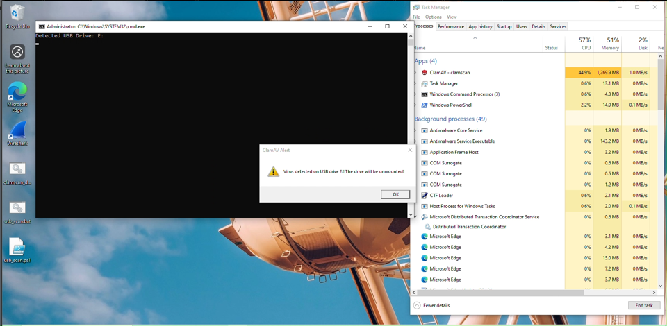
   - Log: 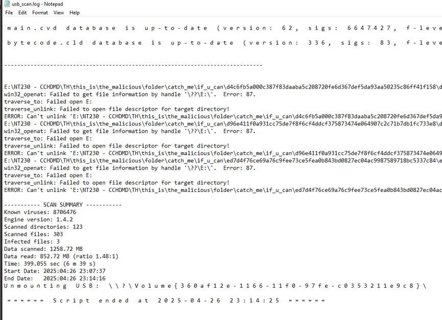

#### 2.2.3. Một số lỗi đã gặp

| Lỗi                                  | Nguyên nhân                                                    | Ảnh hưởng                      |
| ------------------------------------ | -------------------------------------------------------------- | ------------------------------ |
| win32_openat: Failed...              | File path quá dài / file locked / permission deny              | ClamAV không lấy metadata file |
| ERROR: Can't unlink '...' after copy | `--move` cố xóa file gốc nhưng thất bại do lock / path quá dài | File malware vẫn tồn trên USB  |

**Khắc phục**:

- Không dùng `--move` hoặc `--remove`.
- Bật LongPathsEnabled trong registry.
- (Tùy chọn) Thêm bước xóa file bằng PowerShell nếu di chuyển không thành công.

---

## Kết luận

Trong bài này, tôi đã:

- **Thiết lập** ClamAV quét thời gian thực trên Linux với `clamd` + `clamonacc`.
- **Tùy chỉnh** thông báo bằng script `detected.sh`.
- **Lập lịch** quét định kỳ trên Windows bằng Task Scheduler.
- **Tự động quét USB** khi cắm vào, phát hiện malware, và cách ly ổ đĩa.

**Đã hoàn thành**:

- Cấu hình services và file config trên Kali.
- Script PowerShell & Task để quét USB an toàn trên Windows.
- Xử lý báo cáo phát hiện, cách ly file và unmount USB.

**Vẫn còn hạn chế**:

- Một số file malware không thể xóa do path quá dài hoặc file locked.
- Cần bổ sung bước xóa thủ công qua PowerShell.
- Quét realtime trên Windows vẫn phụ thuộc script chứ không native.

**Nhận xét**:  
Trên Linux, ClamAV cung cấp quét realtime mạnh mẽ nhờ fanotify. Trên Windows, phải dùng Task Scheduler kết hợp PowerShell để đạt được tự động hóa, vẫn còn một số giới hạn về xóa file locked và path dài. Tuy nhiên, với các thủ thuật bổ sung (LongPaths, script phụ trợ), ClamAV vẫn là một giải pháp hiệu quả, chi phí thấp cho nhu cầu quét tự động và giám sát USB.
