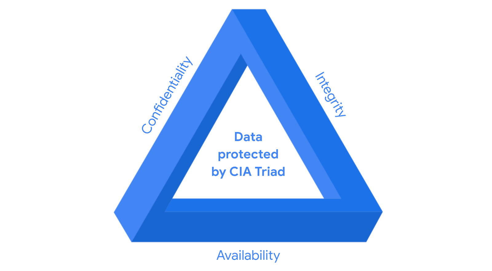

Ehehe, hôm nay tôi và cậu ấy khá rãnh nên tập trung học hết 2 module trong một ngày lun, thành ra là có tới 2 bài đăng lận ~ **(^w^)** Cơ mà nội dung hôm nay khá là dài do tôi và cậu ấy cảm giác không tóm tắt gọn hơn được nữa, sẽ thật tốt nếu mọi người có thể đọc hết. Hi vọng giúp ích cho mọi người! Cùng học thôi nào.

> _"Đạo đức nghề nghiệp rất quan trọng đấy, nhất là ngành của chúng ta." - Cậu ấy nói_

- [📌 Tổng quan về controls, frameworks và compliance trong An ninh mạng](#-tổng-quan-về-controls-frameworks-và-compliance-trong-an-ninh-mạng)
- [🔹 Giới thiệu](#-giới-thiệu)
- [🔹 Mối quan hệ giữa controls, frameworks và compliance](#-mối-quan-hệ-giữa-controls-frameworks-và-compliance)
  - [🔺 CIA Triad: Confidentiality - Integrity - Availability](#-cia-triad-confidentiality---integrity---availability)
  - [🔍 Định nghĩa:](#-định-nghĩa)
- [🔹 Các frameworks và compliance quan trọng](#-các-frameworks-và-compliance-quan-trọng)
  - [🏛️ **NIST (National Institute of Standards and Technology)**](#️-nist-national-institute-of-standards-and-technology)
  - [⚡ **FERC-NERC** (Federal Energy Regulatory Commission - North American Electric Reliability Corporation)](#-ferc-nerc-federal-energy-regulatory-commission---north-american-electric-reliability-corporation)
  - [☁️ **FedRAMP (Federal Risk and Authorization Management Program)**](#️-fedramp-federal-risk-and-authorization-management-program)
  - [🔐 **CIS (Center for Internet Security)**](#-cis-center-for-internet-security)
  - [🇪🇺 **GDPR (General Data Protection Regulation)**](#-gdpr-general-data-protection-regulation)
  - [💳 **PCI DSS (Payment Card Industry Data Security Standard)**](#-pci-dss-payment-card-industry-data-security-standard)
  - [🏥 **HIPAA (Health Insurance Portability and Accountability Act)**](#-hipaa-health-insurance-portability-and-accountability-act)
  - [🌍 **ISO (International Organization for Standardization)**](#-iso-international-organization-for-standardization)
  - [📜 **SOC 1 \& SOC 2 (System and Organizations Controls)**](#-soc-1--soc-2-system-and-organizations-controls)
  - [🏛 **United States Presidential Executive Order 14028**](#-united-states-presidential-executive-order-14028)
- [🎯 Kết luận](#-kết-luận)
- [📌 Ethical Concepts in Cybersecurity](#-ethical-concepts-in-cybersecurity)
- [🔹 Giới thiệu](#-giới-thiệu-1)
- [🛡️ Đạo đức và pháp luật liên quan đến phản công mạng](#️-đạo-đức-và-pháp-luật-liên-quan-đến-phản-công-mạng)
  - [⚖️ Quan điểm của Hoa Kỳ về phản công](#️-quan-điểm-của-hoa-kỳ-về-phản-công)
  - [⚖️ Quan điểm quốc tế về phản công](#️-quan-điểm-quốc-tế-về-phản-công)
- [📌 Nguyên tắc đạo đức trong an ninh mạng](#-nguyên-tắc-đạo-đức-trong-an-ninh-mạng)
  - [1. **Bảo mật (Confidentiality)**](#1-bảo-mật-confidentiality)
  - [2. **Bảo vệ quyền riêng tư (Privacy Protection)**](#2-bảo-vệ-quyền-riêng-tư-privacy-protection)
  - [3. **Tuân thủ pháp luật (Compliance with Laws)**](#3-tuân-thủ-pháp-luật-compliance-with-laws)
- [🎯 Kết luận](#-kết-luận-1)
- [📖 Tóm tắt thuật ngữ - Course 1, Module 3](#-tóm-tắt-thuật-ngữ---course-1-module-3)

## 📌 Tổng quan về controls, frameworks và compliance trong An ninh mạng

## 🔹 Giới thiệu

Trong lĩnh vực an ninh mạng, **controls, frameworks, và compliance** đóng vai trò quan trọng trong việc quản lý rủi ro và đảm bảo tổ chức tuân thủ các quy định bảo mật. Bài viết này sẽ giúp bạn hiểu rõ mối quan hệ giữa chúng và các tiêu chuẩn quan trọng cần biết.

## 🔹 Mối quan hệ giữa controls, frameworks và compliance

### 🔺 CIA Triad: Confidentiality - Integrity - Availability

- **Confidentiality (Bảo mật):** Đảm bảo thông tin chỉ có thể được truy cập bởi những người được phép.
- **Integrity (Toàn vẹn):** Đảm bảo dữ liệu không bị thay đổi hoặc xâm phạm.
- **Availability (Khả dụng):** Đảm bảo hệ thống và dữ liệu luôn sẵn sàng.

### 🔍 Định nghĩa:

- **Security Controls:** Các biện pháp bảo mật nhằm giảm thiểu rủi ro.
- **Security Frameworks:** Bộ hướng dẫn giúp tổ chức thiết lập và duy trì an ninh mạng.
- **Compliance:** Việc tuân thủ các quy định nội bộ và bên ngoài nhằm đảm bảo an toàn dữ liệu.

---

## 🔹 Các frameworks và compliance quan trọng

### 🏛️ **NIST (National Institute of Standards and Technology)**

- **NIST Cybersecurity Framework (CSF):** Cung cấp hướng dẫn bảo mật tổng thể.
- **NIST Risk Management Framework (RMF):** Hỗ trợ quản lý rủi ro trong tổ chức.

### ⚡ **FERC-NERC** (Federal Energy Regulatory Commission - North American Electric Reliability Corporation)

- Quy định về bảo mật cho các tổ chức liên quan đến lưới điện ở Bắc Mỹ.

### ☁️ **FedRAMP (Federal Risk and Authorization Management Program)**

- Chuẩn hóa đánh giá bảo mật cho các dịch vụ và sản phẩm điện toán đám mây.

### 🔐 **CIS (Center for Internet Security)**

- Cung cấp các biện pháp bảo mật giúp tổ chức nâng cao phòng thủ mạng.

### 🇪🇺 **GDPR (General Data Protection Regulation)**

- Bảo vệ quyền riêng tư dữ liệu của công dân EU, yêu cầu minh bạch về việc thu thập và xử lý dữ liệu.

### 💳 **PCI DSS (Payment Card Industry Data Security Standard)**

- Đảm bảo an toàn cho dữ liệu thẻ tín dụng, giảm thiểu gian lận tài chính.

### 🏥 **HIPAA (Health Insurance Portability and Accountability Act)**

- Bảo vệ thông tin y tế của bệnh nhân tại Hoa Kỳ.
- Yêu cầu tuân thủ theo **3 nguyên tắc:** Privacy, Security, Breach Notification.

### 🌍 **ISO (International Organization for Standardization)**

- Đưa ra tiêu chuẩn quốc tế về công nghệ, sản xuất và quản lý chất lượng.

### 📜 **SOC 1 & SOC 2 (System and Organizations Controls)**

- Xác định mức độ bảo mật và quyền truy cập dữ liệu trong tổ chức.

### 🏛 **United States Presidential Executive Order 14028**

- Ban hành năm 2021 nhằm tăng cường an ninh mạng quốc gia Hoa Kỳ. Xem chi tiết tại [Critical Infrastructure](<https://csrc.nist.gov/glossary/term/critical_infrastructure#:~:text=Definition(s)%3A,any%20combination%20of%20those%20matters.>) và [Executive Order on Improving the Nation’s Cybersecurity](https://www.whitehouse.gov/briefing-room/presidential-actions/2021/05/12/executive-order-on-improving-the-nations-cybersecurity/).

---

## 🎯 Kết luận

- **Controls, frameworks, và compliance** là ba yếu tố quan trọng giúp tổ chức duy trì mức độ rủi ro thấp.
- Cần cập nhật liên tục về các tiêu chuẩn và quy định bảo mật để đảm bảo an toàn dữ liệu.
- Là một **SOC Analyst**, việc nắm vững các framework phổ biến sẽ giúp bạn bảo vệ hệ thống và người dùng hiệu quả hơn.

---

## 📌 Ethical Concepts in Cybersecurity

## 🔹 Giới thiệu

Trong lĩnh vực an ninh mạng, đạo đức đóng vai trò quan trọng trong việc hướng dẫn các quyết định của chuyên gia bảo mật. Việc tuân thủ các nguyên tắc đạo đức giúp bảo vệ dữ liệu, tổ chức và con người khỏi các mối đe dọa không ngừng phát triển từ các tác nhân tấn công.

---

## 🛡️ Đạo đức và pháp luật liên quan đến phản công mạng

### ⚖️ Quan điểm của Hoa Kỳ về phản công

- Ở Hoa Kỳ, phản công mạng là **bất hợp pháp** theo các đạo luật như:
  - Đạo luật Lạm dụng và Gian lận Máy tính năm 1986 (Computer Fraud and Abuse Act - CFAA)
  - Đạo luật Chia sẻ Thông tin An ninh mạng năm 2015 (Cybersecurity Information Sharing Act - CISA)
- Phản công bị xem là **hành vi tự phát công lý (vigilantism)**, có thể dẫn đến leo thang xung đột và gây hậu quả nghiêm trọng.
- Nếu đối thủ là hacker do nhà nước bảo trợ (hacktivist), phản công có thể gây ra vấn đề **quốc tế nghiêm trọng**.
- Chỉ có nhân viên chính phủ liên bang hoặc quân đội Hoa Kỳ mới được phép thực hiện phản công.

### ⚖️ Quan điểm quốc tế về phản công

Theo **Tòa án Công lý Quốc tế (ICJ)**, một phản công chỉ hợp pháp khi:

- Chỉ ảnh hưởng đến bên đã tấn công trước.
- Là một phản ứng **trực tiếp và rõ ràng** yêu cầu đối thủ dừng lại.
- Không làm tình hình trở nên xấu hơn.
- Có thể **đảo ngược** hậu quả.

Tuy nhiên, hầu hết các tổ chức **không thực hiện phản công** do khó đo lường tác động và kiểm soát kết quả.

📌 **Tham khảo thêm**: [Tallinn Manual](https://www.nato.int/cps/en/natolive/topics_78170.htm) để tìm hiểu về luật pháp quốc tế trong không gian mạng.

---

## 📌 Nguyên tắc đạo đức trong an ninh mạng

### 1. **Bảo mật (Confidentiality)**

- Chỉ những người được ủy quyền mới có quyền truy cập dữ liệu.
- Đòi hỏi sự **tôn trọng quyền riêng tư** để bảo vệ thông tin cá nhân và tài sản dữ liệu.

### 2. **Bảo vệ quyền riêng tư (Privacy Protection)**

- Dữ liệu cá nhân cần được bảo vệ khỏi sự truy cập trái phép.
- Hai loại dữ liệu quan trọng:
  - **PII (Personally Identifiable Information)**: Thông tin nhận diện cá nhân như tên, số điện thoại.
  - **SPII (Sensitive PII)**: Dữ liệu nhạy cảm hơn như số an sinh xã hội, số thẻ tín dụng.
- Chuyên gia bảo mật có trách nhiệm bảo vệ thông tin, xác định lỗ hổng, và quản lý rủi ro.

### 3. **Tuân thủ pháp luật (Compliance with Laws)**

- Chuyên gia bảo mật phải **công bằng, trung thực, và tôn trọng luật pháp**.
- Cần **minh bạch**, dựa trên **bằng chứng**, và **luôn học hỏi** để nâng cao kỹ năng.
- Ví dụ:
  - **HIPAA (Health Insurance Portability and Accountability Act)**: Luật bảo vệ thông tin sức khỏe bệnh nhân.
  - Chuyên gia bảo mật phải đảm bảo tổ chức tuân thủ luật này và **thông báo vi phạm** nếu dữ liệu bệnh nhân bị lộ.

---

## 🎯 Kết luận

Là một chuyên gia bảo mật tương lai, bạn cần hiểu rõ về đạo đức và luật pháp để đưa ra các quyết định đúng đắn trong xử lý sự cố an ninh mạng. Việc tuân thủ các nguyên tắc đạo đức giúp bảo vệ cả tổ chức lẫn cá nhân khỏi những mối đe dọa ngày càng tinh vi.

🚀 **Luôn cập nhật và thực hành để trở thành chuyên gia bảo mật xuất sắc!** 🔐

## 📖 Tóm tắt thuật ngữ - Course 1, Module 3

| **Thuật ngữ**                                                                            | **Định nghĩa**                                                                                                                       |
| ---------------------------------------------------------------------------------------- | ------------------------------------------------------------------------------------------------------------------------------------ |
| **Asset**                                                                                | Một mục được coi là có giá trị đối với tổ chức.                                                                                      |
| **Availability**                                                                         | Khả năng dữ liệu có thể được truy cập bởi những người được ủy quyền.                                                                 |
| **Compliance**                                                                           | Quá trình tuân thủ các tiêu chuẩn nội bộ và quy định bên ngoài.                                                                      |
| **Confidentiality**                                                                      | Chỉ những người được ủy quyền mới có thể truy cập vào tài sản hoặc dữ liệu cụ thể.                                                   |
| **Confidentiality, Integrity, Availability (CIA) triad**                                 | Mô hình giúp tổ chức đánh giá rủi ro khi thiết lập hệ thống và chính sách bảo mật.                                                   |
| **Hacktivist**                                                                           | Một cá nhân sử dụng kỹ thuật tấn công mạng để đạt được mục tiêu chính trị.                                                           |
| **Health Insurance Portability and Accountability Act (HIPAA)**                          | Luật liên bang Hoa Kỳ được thiết lập để bảo vệ thông tin y tế của bệnh nhân.                                                         |
| **Integrity**                                                                            | Dữ liệu chính xác, xác thực và đáng tin cậy.                                                                                         |
| **National Institute of Standards and Technology (NIST) Cyber Security Framework (CSF)** | Một khung tự nguyện gồm các tiêu chuẩn, hướng dẫn và thực tiễn tốt nhất để quản lý rủi ro an ninh mạng.                              |
| **Privacy protection**                                                                   | Bảo vệ thông tin cá nhân khỏi việc sử dụng trái phép.                                                                                |
| **Protected health information (PHI)**                                                   | Thông tin liên quan đến tình trạng sức khỏe thể chất hoặc tinh thần của một cá nhân trong quá khứ, hiện tại hoặc tương lai.          |
| **Security architecture**                                                                | Một loại thiết kế bảo mật bao gồm nhiều thành phần như công cụ và quy trình nhằm bảo vệ tổ chức khỏi rủi ro và mối đe dọa bên ngoài. |
| **Security controls**                                                                    | Các biện pháp bảo vệ được thiết kế để giảm thiểu rủi ro bảo mật cụ thể.                                                              |
| **Security ethics**                                                                      | Hướng dẫn đưa ra quyết định phù hợp với tư cách là một chuyên gia bảo mật.                                                           |
| **Security frameworks**                                                                  | Hướng dẫn được sử dụng để xây dựng kế hoạch giúp giảm thiểu rủi ro và các mối đe dọa đối với dữ liệu và quyền riêng tư.              |
| **Security governance**                                                                  | Các thực tiễn giúp hỗ trợ, xác định và định hướng các nỗ lực bảo mật của tổ chức.                                                    |
| **Sensitive personally identifiable information (SPII)**                                 | Một loại PII cụ thể cần tuân theo các quy định xử lý nghiêm ngặt hơn.                                                                |
