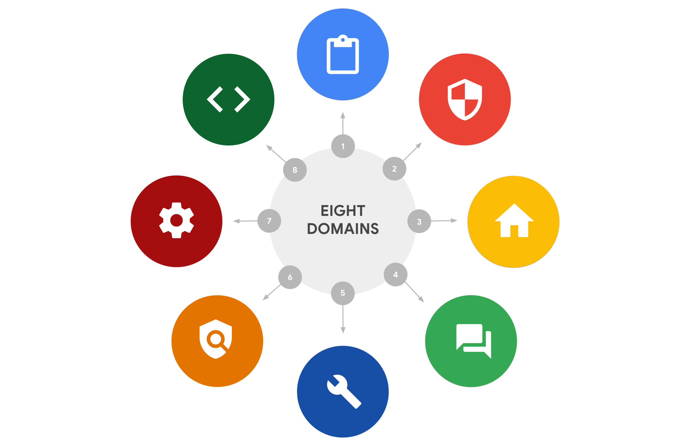
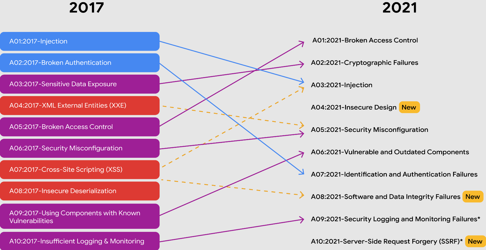

Chào buổi tối, mọi người vẫn khỏe chứ? Hôm nay là bài học đầu tiên của khóa học mới rồi, Course 2 này sẽ tập trung vào các nội dung gồm chi tiết CISSP's domains, security frameworks and controls, cách sử dụng security tools and audits. Qua đó giúp mọi người có hiểu biết sâu hơn về cách để tổ chức và người dùng an toàn khỏi các mối đe dọa, rủi ro và lỗ hổng. Giờ thì bắt đầu thôi nào.

## 🔐 Tám lĩnh vực bảo mật của CISSP

## 📌 Giới thiệu

Trong lĩnh vực an ninh mạng, các chuyên gia bảo mật làm việc với nhiều lĩnh vực khác nhau để bảo vệ tổ chức khỏi rủi ro. CISSP (Certified Information Systems Security Professional) xác định tám lĩnh vực quan trọng giúp tổ chức quản lý bảo mật hiệu quả. Dưới đây là vai trò và hoạt động của từng lĩnh vực.

## 🔹 1. Security and Risk Management

- **Xác định và giảm thiểu rủi ro bảo mật**
- **Tuân thủ các quy định và pháp luật**
- **Kế hoạch đảm bảo hoạt động kinh doanh liên tục (BCP - Business continuity planning)**
- **Ứng phó sự cố và quản lý lỗ hổng**
- **Đảm bảo bảo mật thông tin (InfoSec):** Đề cập đến một tập hợp các quy trình được thiết lập để bảo mật thông tin, có thể bao gồm: Incident response, Vulnerability management, Application security, Cloud security, Infrastructure security.
- **Các yếu tố ảnh hưởng đến security posture:** Security goals and objectives, Risk mitigation processes, Compliance, Business continuity plans, Legal regulations, Professional and organizational ethics.

📌 _Ví dụ:_ Một công ty có thể thay đổi cách xử lý dữ liệu cá nhân để tuân thủ GDPR - General Data Protection Regulation.

---

## 🔹 2. Asset Security

- **Quản lý tài sản bảo mật (cả vật lý và kỹ thuật số)**
- **Sao lưu và phục hồi dữ liệu**
- **Xác định mức độ rủi ro của tài sản**
- **Hủy dữ liệu đúng cách để ngăn chặn truy cập trái phép**

📌 _Ví dụ:_ Bảo vệ dữ liệu khách hàng bằng cách mã hóa và thiết lập hệ thống sao lưu định kỳ.

---

## 🔹 3. Security Architecture and Engineering

- **Thiết kế hệ thống bảo mật**
- **Áp dụng nguyên tắc "Zero Trust" và "Least Privilege"**
- **Phát triển các công cụ và quy trình bảo vệ dữ liệu**
- **Phân tầng phòng thủ (Defense in Depth)**
- Ngoài ra còn có một số nguyên tắc khắc như: Threat modeling, Fail securely, Separation of duties, Keep it simple, Trust but verify.

📌 _Ví dụ:_ Sử dụng SIEM để theo dõi hoạt động đăng nhập bất thường.

---

## 🔹 4. Communication and Network Security

- **Bảo vệ hệ thống mạng vật lý và không dây**
- **Kiểm soát truy cập từ xa**
- **Thiết lập tường lửa và mã hóa dữ liệu truyền tải**

📌 _Ví dụ:_ Hạn chế quyền truy cập vào mạng nội bộ khi làm việc từ xa.

---

## 🔹 5. Identity and Access Management (IAM)

- **Xác thực và cấp quyền người dùng**
- **Triển khai nguyên tắc "Least Privilege"**
- **Quản lý danh tính và xác thực hai yếu tố (2FA)**

📌 _Ví dụ:_ Nhân viên chỉ có thể truy cập vào dữ liệu cần thiết cho công việc.

---

## 🔹 6. Security Assessment and Testing

- **Đánh giá và kiểm thử bảo mật**
- **Thực hiện kiểm thử xâm nhập (Penetration Testing)**
- **Phân tích dữ liệu và đánh giá lỗ hổng bảo mật**

📌 _Ví dụ:_ Một công ty thuê chuyên gia kiểm thử (Pentester) hệ thống để phát hiện điểm yếu trước khi kẻ xấu khai thác.

---

## 🔹 7. Security Operations

- **Giám sát và phản hồi sự cố bảo mật**
- **Phân tích nhật ký hệ thống (Log Analysis)**
- **Quản lý hệ thống phát hiện và ngăn chặn xâm nhập (IDS/IPS)**
- Lĩnh vực này sử dụng nhiều các chiến lược, quy trình và các công cụ như: Training and awareness, Reporting and documentation, Intrusion detection and prevention, SIEM tools, Log management, Incident management, Playbooks, Post-breach forensics, Reflecting on lessons learned.

📌 _Ví dụ:_ Khi phát hiện đăng nhập bất thường ngoài giờ làm việc, đội ngũ bảo mật sẽ điều tra và phản ứng ngay lập tức.

---

## 🔹 8. Software Development Security

- **Tích hợp bảo mật vào vòng đời phát triển phần mềm (SDLC)**
- **Kiểm thử bảo mật ứng dụng (Application Security Testing)**
- **Bảo vệ dữ liệu người dùng trong phần mềm**

📌 _Ví dụ:_ Đảm bảo mã hóa dữ liệu bệnh nhân trong một ứng dụng y tế.

---

## 🎯 Kết Luận

- Hiểu rõ tám lĩnh vực bảo mật của CISSP giúp bạn định hướng sự nghiệp trong an ninh mạng.
- Việc áp dụng nguyên tắc **Zero Trust**, **Least Privilege**, và **Defense in Depth** giúp tăng cường bảo mật.

---

## 🛡️ Quản lý rủi ro, mối đe dọa và lỗ hổng trong An ninh Mạng

Trong lĩnh vực an ninh mạng, hiểu rõ **rủi ro, mối đe dọa và lỗ hổng bảo mật** (risks, threats, vunerabilities) giúp tổ chức xây dựng chính sách phòng chống hiệu quả.

## 🔹 Quản lý rủi ro (Risk Management)

**Tài sản (Asset)** là bất kỳ thứ gì có giá trị đối với tổ chức, bao gồm:

- **Tài sản kỹ thuật số:** Dữ liệu cá nhân (SSN, ngày sinh, số tài khoản ngân hàng, địa chỉ,...).
- **Tài sản vật lý:** Máy chủ, máy tính, văn phòng, ki-ốt thanh toán.

### 🔍 Chiến Lược Quản Lý Rủi Ro

| **Chiến Lược**   | **Mô Tả**                                         |
| ---------------- | ------------------------------------------------- |
| **Acceptance**   | Chấp nhận rủi ro để duy trì hoạt động kinh doanh. |
| **Avoidance**    | Lập kế hoạch để tránh rủi ro.                     |
| **Transference** | Chuyển rủi ro cho bên thứ ba.                     |
| **Mitigation**   | Giảm thiểu tác động của rủi ro.                   |

📌 _Ví dụ:_ Một công ty áp dụng frameworks [NIST RMF](https://csrc.nist.gov/projects/risk-management/about-rmf) hoặc [HITRUST](https://hitrustalliance.net/product-tool/hitrust-csf/?utm_term=&utm_campaign=HITRUST_i1_PaidSearch&utm_source=adwords&utm_medium=ppc&hsa_acc=2724012343&hsa_cam=16641331914&hsa_grp=136906352837&hsa_ad=598980848547&hsa_src=g&hsa_tgt=dsa-1659695676388&hsa_kw=&hsa_mt=&hsa_net=adwords&hsa_ver=3&gclid=Cj0KCQiAorKfBhC0ARIsAHDzsluRN5tSpCQal-rYnZLo2wUNppQdUHUba82LMX3JMGOoRPEJ6wG6-LgaAryYEALw_wcB) để bảo vệ dữ liệu khách hàng.

---

## 🔹 Các mối đe dọa phổ biến

| **Mối Đe Dọa**                         | **Mô Tả**                                                         |
| -------------------------------------- | ----------------------------------------------------------------- |
| **Insider Threats**                    | Nhân viên/vendor lạm dụng quyền truy cập để lấy dữ liệu.          |
| **Advanced Persistent Threats (APTs)** | Kẻ tấn công duy trì quyền truy cập trái phép trong thời gian dài. |

---

## 🔹 Các rủi ro trong tổ chức

| **Loại Rủi Ro**         | **Mô Tả**                                                     |
| ----------------------- | ------------------------------------------------------------- |
| **External Risk**       | Mối đe dọa từ bên ngoài, như hacker cố gắng xâm nhập dữ liệu. |
| **Internal Risk**       | Rủi ro từ nhân viên, vendor hoặc đối tác đáng tin cậy.        |
| **Legacy Systems**      | Hệ thống cũ không được cập nhật, dễ bị khai thác.             |
| **Multiparty Risk**     | Rủi ro khi bên thứ ba truy cập vào tài sản quan trọng.        |
| **Software Compliance** | Phần mềm không tuân thủ tiêu chuẩn hoặc chưa cập nhật.        |

📌 _Tìm hiểu thêm:_ [OWASP Top 10](https://owasp.org/www-project-top-ten/)

---

## 🔹 Lỗ hổng bảo mật (Vulnerabilities)

| **Lỗ Hổng**                            | **Mô Tả**                                                                   |
| -------------------------------------- | --------------------------------------------------------------------------- |
| **ProxyLogon**                         | Ảnh hưởng đến Microsoft Exchange, cho phép thực thi mã độc từ xa.           |
| **ZeroLogon**                          | Lỗ hổng xác thực Netlogon trên Windows, giúp hacker chiếm quyền điều khiển. |
| **Log4Shell**                          | Cho phép hacker thực thi mã Java từ xa.                                     |
| **PetitPotam**                         | Tấn công NTLM trên Windows để đánh cắp thông tin xác thực.                  |
| **Server-Side Request Forgery (SSRF)** | Kẻ tấn công có thể ép buộc máy chủ truy cập vào tài nguyên không mong muốn. |

📌 _Tham khảo:_ [NIST National Vulnerability Database](https://nvd.nist.gov/vuln)

---

## 🎯 Kết Luận

- **Hiểu rõ rủi ro, mối đe dọa và lỗ hổng bảo mật** giúp tổ chức giảm thiểu nguy cơ bị tấn công.
- **Áp dụng các framework như NIST RMF và OWASP** để tăng cường bảo vệ dữ liệu.
- **Luôn cập nhật thông tin mới nhất** về các kỹ thuật tấn công và giải pháp phòng ngừa.

🚀 **Trang bị kiến thức vững chắc để bảo vệ tổ chức và người dùng!** 🔐

---

## Terms and definitions from Course 2, Module 1

| **Thuật ngữ**             | **Định nghĩa**                                                                                                                          |
| ------------------------- | --------------------------------------------------------------------------------------------------------------------------------------- |
| **Assess**                | Bước thứ năm trong NIST RMF, nhằm xác định liệu các biện pháp kiểm soát có được thực hiện đúng cách hay không.                          |
| **Authorize**             | Bước thứ sáu trong NIST RMF, liên quan đến trách nhiệm về các rủi ro bảo mật và quyền riêng tư có thể tồn tại trong tổ chức.            |
| **Business continuity**   | Khả năng của tổ chức trong việc duy trì hoạt động hàng ngày bằng cách thiết lập các kế hoạch khôi phục rủi ro và thảm họa.              |
| **Categorize**            | Bước thứ hai trong NIST RMF, được sử dụng để phát triển quy trình và nhiệm vụ quản lý rủi ro.                                           |
| **External threat**       | Bất kỳ mối đe dọa nào bên ngoài tổ chức có thể gây hại cho tài sản của tổ chức.                                                         |
| **Implement**             | Bước thứ tư trong NIST RMF, có nghĩa là triển khai các kế hoạch bảo mật và quyền riêng tư cho tổ chức.                                  |
| **Internal threat**       | Nhân viên hiện tại hoặc cũ, nhà cung cấp bên ngoài hoặc đối tác đáng tin cậy có thể gây rủi ro bảo mật.                                 |
| **Monitor**               | Bước thứ bảy trong NIST RMF, có nghĩa là theo dõi tình trạng hoạt động của hệ thống.                                                    |
| **Prepare**               | Bước đầu tiên trong NIST RMF, liên quan đến các hoạt động cần thiết để quản lý rủi ro bảo mật và quyền riêng tư trước khi xảy ra sự cố. |
| **Ransomware**            | Một cuộc tấn công độc hại trong đó kẻ tấn công mã hóa dữ liệu của tổ chức và yêu cầu thanh toán để khôi phục quyền truy cập.            |
| **Risk**                  | Bất cứ điều gì có thể ảnh hưởng đến tính bảo mật, toàn vẹn hoặc khả dụng của một tài sản.                                               |
| **Risk mitigation**       | Quá trình thiết lập các quy trình và quy tắc phù hợp để nhanh chóng giảm thiểu tác động của rủi ro như vi phạm bảo mật.                 |
| **Security posture**      | Khả năng của tổ chức trong việc quản lý phòng thủ tài sản quan trọng và phản ứng với thay đổi.                                          |
| **Select**                | Bước thứ ba trong NIST RMF, có nghĩa là lựa chọn, tùy chỉnh và ghi lại các biện pháp kiểm soát bảo vệ tổ chức.                          |
| **Shared responsibility** | Ý tưởng rằng tất cả cá nhân trong tổ chức đều đóng vai trò tích cực trong việc giảm thiểu rủi ro và duy trì an ninh vật lý cũng như ảo. |
| **Social engineering**    | Kỹ thuật thao túng con người để khai thác lỗi sai và thu thập thông tin cá nhân, quyền truy cập hoặc tài sản có giá trị.                |
| **Vulnerability**         | Một điểm yếu có thể bị khai thác bởi một mối đe dọa.                                                                                    |
