> Đây là ai, đoán xem? \
> Một chàng trai nghiêm túc, ít nói, thường xuất hiện với những chiếc áo sơ mi và quần tây trông cũng rất là nghiêm túc. Anh chàng này lúc nào cũng suy nghĩ nhiều, lo xa, trông lúc nào cũng bận rộn và nhiều việc nhưng thật sự thì chỉ là anh chàng làm việc khá chậm và hay làm trước/làm thay người ta thôi.\
> \
> Hmmm, ai vậy nhỉ? Mọi người có đoán ra chưa?\
> Đúng rồi, là tôi/cậu ấy đó `\(>ω< )/` Ehehe, mọi người còn nhớ tôi và cậu ấy hong :3 Lâu quá mới gặp lại mọi người. Thời gian thực tập thì cuối tuần chúng tôi đi chữa lành hoặc viết report định kỳ, nên là không dư thời gian để làm blog chia sẻ được. Hôm nay tranh thủ làm một bài kể lại quá trình thực tập của chúng tôi nha :3

## Ngày đầu tiên

> Ahaha, nghĩ lại cũng hơi mắc cười một chút, đúng là chúng tôi không bỏ được tính lo xa này mà. Lúc nhận được mail thông báo đã được nhận thì trong mail chỉ có ngày bắt đầu làm việc thôi, không có giờ cụ thể. Tôi thì tính liên hệ chị HR để hỏi nhưng mà cậu ấy bảo chủ nhật rồi người ta không rep đâu, nên cuối cùng cả hai không liên lạc luôn :v . Đến ngày thực tập đó thì dựa theo giờ làm việc của Trung tâm và đi sớm hơn gần 30p, cuối cùng thì đợi tới gần 1 tiếng lận 😂, tại giờ làm việc cũng của các anh chị cũng không giống trong thông tin. Mà thôi kệ, đến sớm rồi đợi chứ ngày đầu mà đến trễ thì sẽ để lại ấn tượng xấu mất! Sau đó thì tôi cùng cậu ấy liên hệ với anh Quản lý để nhận việc, trước hết là dọn chỗ để ngồi (chỗ làm hiện tại của Sếp `(⊙_⊙;)` ), xong xuôi rồi thì lên họp với anh Quản lý và anh Sếp để nắm quy định, cách làm việc và làm quen với mọi người trong Trung tâm.\
> \
> Xong rồi thì ... ờm, đợi nhận việc tiếp :v mà kết quả là đợi cả buổi cũng chưa có gì, haha. Thế là trưa mọi người ở trung tâm mời đi ăn chung để làm quen, chúng tôi cũng đi và ngồi trò chuyện đôi chút, xong rồi ngủ trưa luôn. Lúc chiều dậy, thấy vẫn chưa có việc nên tính xin về sớm thì anh Sếp bảo qua nhận việc `:)))` Tự dưng thấy mình có vẻ lười biếng... Ahaha, thế rồi có việc thì làm thôi, đến chiều thì về :v Thế là hết ngày đầu tiên gòi.

## Nhiệm vụ được giao và công việc hàng ngày

> Nhiệm vụ của tôi và cậu ấy là triển khai công cụ đánh giá hiệu năng K6, công cụ giám sát hệ thống, website có tính HA (High Availability) trên môi trường K8s (Kubernetes). Anh Sếp sẽ đưa ra từng mục tiêu nhỏ, cứ mỗi cuối tuần sẽ báo cáo cho ảnh tiến độ công việc, nếu xong rồi thì ảnh sẽ đặt ra những câu hỏi về mục tiêu vừa hoàn thành, từ đó đưa ra mục tiêu tiếp theo. Nên thành ra cả quá trình thực tập mọi thứ rất liền mạch, cũng không bị áp lực.\
> \
> Do Trung tâm chỉ yêu cầu có mặt 5 buổi/tuần nên thời gian của chúng tôi khá linh hoạt, có thể đi cả ngày hoặc chỉ đi 1 buổi, tùy lịch trình của tuần đó hoặc tình trạng sức khỏe mà sắp xếp. Có lần tôi bệnh nằm lì ở ký túc xá, anh Sếp cho tôi báo cáo online luôn. Bình thường thì sáng ra tôi sẽ pha cà phê, tập thể dục một tí nếu tối qua ngủ đủ giấc, nấu ăn vài món đơn giản rồi tắm rửa sửa soạn để lên trung tâm, hôm nào thiếu ngủ thì ngủ nướng một chút rồi làm ở nhà, tới chiều mới lên Trung tâm, hehe.\
> \
> Nhiệm vụ chính là triển khai nên phần lớn thời gian tôi và cậu ấy dành thời gian ra tìm hiểu về công cụ, sản phẩm, môi trường cần triển khai rồi để biết cách cấu hình, tùy chỉnh, cài đặt và sửa lỗi, thật sự thì có rất rất nhiều lỗi luôn. Rồi còn viết kịch bản để test nữa, kiểm thử hiệu năng của website nên sẽ viết kịch bản mô phỏng lại hành vi của người dùng khi truy cập trang web như truy cập, đăng nhập, xem nội dung, chuyển trang, đăng xuất... Rồi đưa kịch bản đó vào công cụ kiểm thử K6 để test, xong rồi ghi kết quả vào báo cáo, nếu có lỗi thì debug chi tiết ra để đưa cho team Dev khắc phục, bên cạnh đó thì cũng phải giám sát tài nguyên K8s được sử dụng khi test, liệu có vượt quá mức cho phép không? có bị ngắt bất thường không? có chênh lệch gì giữa các lần test không? để đảm bảo công cụ hoạt động ổn định, hệ thống không quá tải.

## Kết quả đạt được

Luyên thuyên nãy giờ gòi, giờ xem tôi và cậu ấy đã làm được những gì nào?

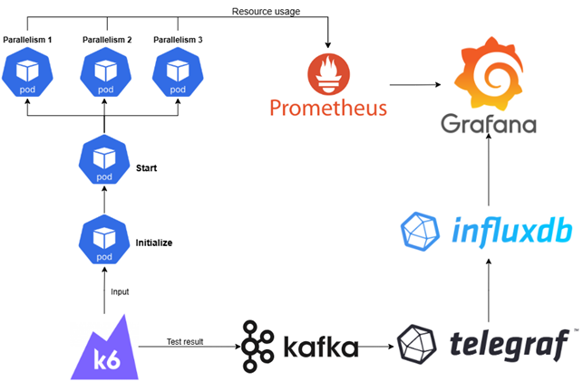

### Kiến thức về K8s

> Thật sự thì đây là lần đầu tiên tôi và cậu ấy sử dụng nền tảng quản lý container K8s này, lúc trước có biết nhưng chưa có dịp để dùng :v Còn sử dụng Docker image thì cũng có nhưng cũng chưa tìm hiểu sâu lắm. Nên lúc đầu thực tập tôi và cậu ấy phải mất vài ngày để tìm hiểu và làm quen với các khái niệm trong nền tảng này. Giờ thì nắm được kha khá các thành phần, cách hoạt động của K8s rồi :3 Điểm mạnh của K8s thì chắc chắn phải kể đến khả năng mở rộng (scalable) dựa trên mức sử dụng của ứng dụng được triển khai để tối ưu tài nguyên rồi. Cũng có thể kể đến việc phân quyền dựa trên vai trò (RBAC) của K8s giúp đảm bảo nguyên tắc về quyền tối thiểu, giảm thiểu rủi ro bảo mật nữa :3 \
> \  
> À mà, tôi và cậu ấy là Cluster Owner - vai trò cao nhất trong K8s nha, còn lý do thì tí nữa tôi sẽ kể ở phần [Khó khăn và cách giải quyết](#khó-khăn-và-cách-giải-quyết), hehe.

---

### Công cụ kiểm thử hiệu năng

#### Testkube

> Đây là mục tiêu lúc đầu của tôi được giao để tìm hiểu và triển khai á, cơ mà do còn nhiều lỗi vì là công cụ mới và không phù hợp mục đích triển khai nên đã bị loại bỏ rồi. Hi vọng là sau này công cụ sẽ được cải tiến thêm :>

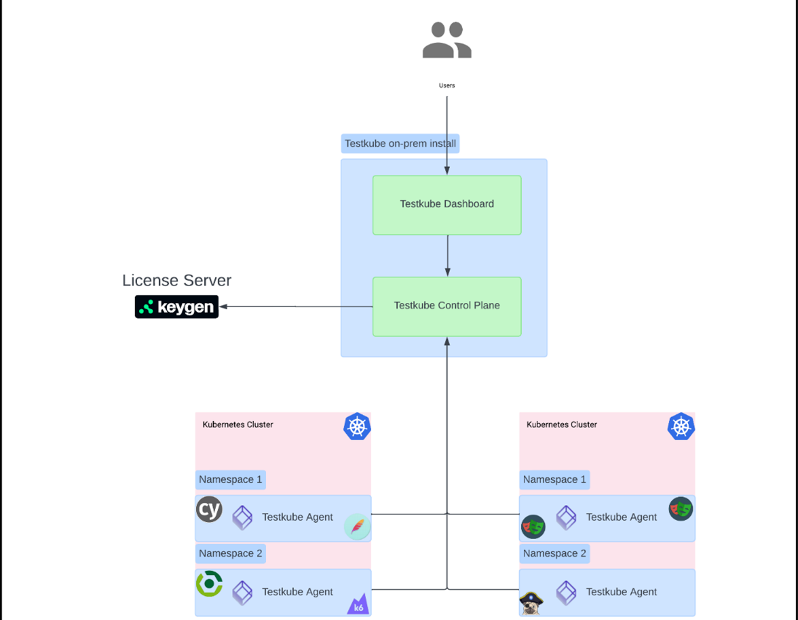

Testkube là một framework kiểm thử mã nguồn mở được thiết kế để tích hợp trực tiếp với Kubernetes, cho phép tự động hóa việc thực thi các bài kiểm thử trong môi trường Cloud-Native.

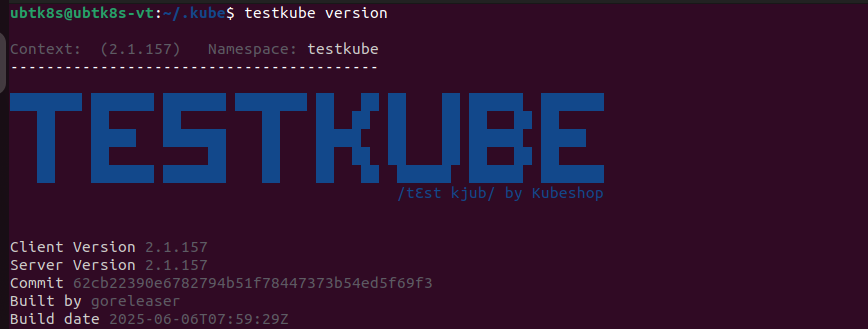

**Một số khả năng nổi bật của Testkube:**

- Tự động hóa kiểm thử: Testkube cho phép định nghĩa các bài kiểm thử dưới dạng tài nguyên tùy chỉnh (Custom Resources - CRD) của Kubernetes, giúp tích hợp kiểm thử một cách tự nhiên vào cụm K8s.
- Hỗ trợ đa dạng công cụ: Testkube có một hệ sinh thái các Executor hỗ trợ nhiều công cụ kiểm thử phổ biến như k6, Cypress, Playwright, JMeter, Postman, và SoapUI. Điều này giúp dễ dàng sử dụng các công cụ cần thiết mà không cần thay đổi quy trình.
- Tích hợp CI/CD: Testkube dễ dàng kết nối với các công cụ CI/CD truyền thống như GitHub Actions, GitLab CI, và Jenkins, cho phép kích hoạt các bài kiểm thử như một phần của quy trình triển khai ứng dụng.
- Bảo mật: Các bài kiểm thử được chạy bên trong các Pod riêng biệt, giúp cách ly chúng khỏi các ứng dụng chính. Giao tiếp giữa các thành phần được mã hóa bằng TLS, và việc kiểm soát truy cập được thực hiện thông qua RBAC (Role-Based Access Control).
- Quản lý tập trung: Testkube cung cấp một Dashboard trực quan cho phép quản lý, theo dõi và phân tích kết quả kiểm thử một cách dễ dàng.
- Khả năng mở rộng: Bằng cách tận dụng khả năng của Kubernetes, Testkube có thể chạy các bài kiểm thử ở quy mô lớn, hỗ trợ cả kiểm thử tải (load testing) và kiểm thử chức năng (functional testing).

**Luồng hoạt động:**

- Định nghĩa bài test bằng YAML hoặc thông qua Dashboard.
- Agent khởi tạo Pods test trong cụm K8s, chạy công cụ kiểm thử (ví dụ: k6).
- Logs, artifact, kết quả được trả về và hiển thị qua Dashboard.

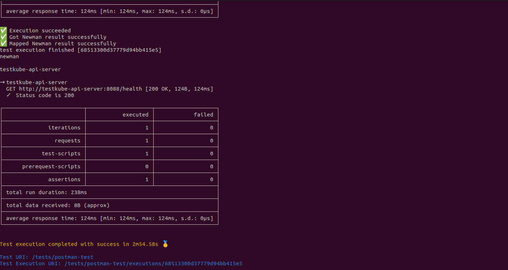

**Ưu điểm:** Giảm phụ thuộc vào CI/CD pipeline, hỗ trợ đa cụm, scale tốt.

**Nhược điểm:** Hệ sinh thái còn mới, một số tính năng (ví dụ xuất dữ liệu từ distributed worker sang InfluxDB) chưa thực sự ổn định.

#### K6

> Đây là công cụ chính được sử dụng xuyên suốt trong quá trình thực tập của chúng tôi nè :> Ban đầu thì tôi và cậu ấy không tìm hiểu nhiều về công cụ này, chỉ có viết kịch bản để test thôi, về sau khi cần tận dụng tính năng phân phối kiểm thử tự động thì mới tìm hiểu kỹ.

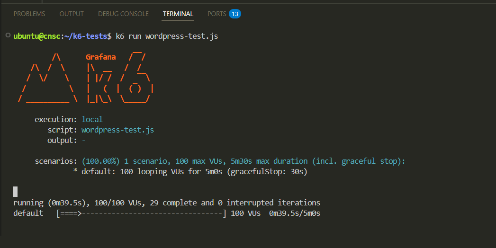

Grafana K6 là một công cụ mã nguồn mở (open-source) được thiết kế để thực hiện kiểm thử hiệu năng (performance testing) và kiểm thử tải (load testing) cho các ứng dụng, đặc biệt là các API, website, và hệ thống microservices, hỗ trợ viết kịch bản bằng JavaScript, được thiết kế để dễ sử dụng, tự động hóa và tích hợp với các hệ thống DevOps/CI/CD trong môi trường Cloud-Native.

**Mục đích:**

- Kiểm thử tải và hiệu năng: k6 được tối ưu để tiêu tốn ít tài nguyên, phù hợp cho các bài kiểm thử tải nặng như spike, stress, hoặc soak test.
- Kiểm thử hiệu năng trình duyệt: Qua API trình duyệt của k6, có thể kiểm thử hiệu năng dựa trên trình duyệt, thu thập số liệu và kết hợp với các bài test khác để có cái nhìn toàn diện.
- Giám sát hiệu năng và kiểm thử định kỳ: Có thể lên lịch chạy các bài test nhẹ thường xuyên để theo dõi hiệu năng hệ thống sản xuất. Có thể tích hợp với Grafana Cloud để giám sát tổng hợp.
- Tự động hóa kiểm thử hiệu năng: k6 tích hợp tốt với CI/CD, giúp Dev tự động hóa kiểm thử trong quy trình phát triển và triển khai phần mềm.
- Kiểm thử độ chịu lỗi và hỗn loạn: Có thể mô phỏng lưu lượng hoặc gây lỗi trong hệ thống (như Kubernetes) thông qua công cụ xk6-disruptor để kiểm tra khả năng phục hồi.
- Kiểm thử hạ tầng: Với các tiện ích mở rộng, k6 hỗ trợ thêm giao thức mới hoặc kiểm thử trực tiếp các thành phần cụ thể trong hạ tầng.

**Các loại test:**

| Loại Test                      | Mục tiêu                                                                              | Đặc điểm                                                                                                           |
| ------------------------------ | ------------------------------------------------------------------------------------- | ------------------------------------------------------------------------------------------------------------------ |
| **Smoke Test**                 | Kiểm tra nhanh hệ thống có hoạt động cơ bản không trước khi chạy test lớn hơn.        | - Tải thấp, thời gian ngắn (vài giây đến vài phút).- 1–10 VUs, gửi vài request để xem server phản hồi ổn không.    |
| **Load Test (Ramping)**        | Xác định hiệu năng hệ thống trong điều kiện tải trung bình hoặc dự kiến.              | - Tăng dần số VUs đến mức ổn định.- Đo thời gian phản hồi, số lỗi, throughput.                                     |
| **Stress Test**                | Tìm ngưỡng tối đa chịu tải và phản ứng khi quá tải.                                   | - Tăng tải liên tục đến khi hệ thống chậm/hỏng.- Xác định bottlenecks.                                             |
| **Spike Test**                 | Kiểm tra phản ứng hệ thống khi tăng tải đột ngột.                                     | - Tăng đột biến số VUs rồi giảm ngay.- Kiểm tra elastic scaling hoặc crash behavior.                               |
| **Soak Test (Endurance Test)** | Kiểm tra độ ổn định lâu dài dưới tải vừa phải.                                        | - Chạy nhiều giờ đến vài ngày.- Tìm rò rỉ bộ nhớ, lỗi tích lũy, suy giảm hiệu suất.                                |
| **Breakpoint Test**            | Xác định mức tải chính xác khi hệ thống bắt đầu fail (giữa load test và stress test). | - Tăng tải từng bước nhỏ.- Quan sát mức suy giảm hiệu năng.                                                        |
| **Capacity Test**              | Tìm ngưỡng người dùng tối đa mà hệ thống vẫn đáp ứng hiệu năng chấp nhận được.        | - Tập trung mối quan hệ giữa VUs và độ trễ/hỏng.- Có thể đặt threshold, ví dụ: http_req_duration: ['p(95) < 500']. |

**Các loại executor:**

| Executor                  | Hoạt động                                                                      | Chức năng                                                      | Tham số bắt buộc                                                    |
| ------------------------- | ------------------------------------------------------------------------------ | -------------------------------------------------------------- | ------------------------------------------------------------------- |
| **shared-iterations**     | Các VUs chia nhau thực hiện một số lượng iteration cố định.                    | Chạy một số lần nhất định, không quan trọng thời gian.         | `iterations`                                                        |
| **per-vu-iterations**     | Mỗi VU thực hiện số lần iteration riêng biệt.                                  | Mô phỏng người dùng có hành vi cố định.                        | `iterations, vus`                                                   |
| **constant-vus**          | Số VU cố định chạy liên tục trong khoảng thời gian xác định.                   | Giữ tải ổn định để đo performance.                             | `vus, duration`                                                     |
| **ramping-vus**           | Tăng/giảm số VU theo thời gian.                                                | Mô phỏng mức tải tăng dần hoặc giảm dần.                       | `stages: [{ duration, target }]`                                    |
| **constant-arrival-rate** | Gửi số request (iterations) cố định trong mỗi đơn vị thời gian, bất kể số VUs. | Mô phỏng hệ thống theo số request/giây (RPS).                  | `rate, duration, preAllocatedVUs, maxVUs`                           |
| **ramping-arrival-rate**  | Tạo số lượng iteration thay đổi theo thời gian.                                | Mô phỏng số request/giây tăng/giảm theo thời gian.             | `stages: [{ duration, target }], duration, preAllocatedVUs, maxVUs` |
| **externally-controlled** | Điều khiển test từ bên ngoài (API, k6 Operator, Testkube…).                    | Tích hợp vào các hệ thống test động như CI/CD hoặc Kubernetes. | —                                                                   |

---

### Công cụ giám sát

#### Grafana

> Có thể nói ngắn gọn là nơi hiển thị tất cả các dữ liệu thu thập được thành các bảng điều khiển/giám sát (Dashboard) :v

Cụ thể thì Grafana là một nền tảng mã nguồn mở chuyên dùng để phân tích và trực quan hóa dữ liệu. Nó kết nối với các nguồn dữ liệu khác nhau, chẳng hạn như InflluxDB, Prometheus và Loki, để tạo ra các dashboard tùy chỉnh. Trong quá trình thực tập thì Grafana được sử dụng để hiển thị quá trình kiểm thử hiệu năng của k6, tài nguyên của Pods, Workers cũng như Nodes theo thời gian thực, giúp dễ dàng theo dõi tải của hệ thống trong quá trình kiểm thử cũng như log của các đối tượng trong Cluster thu thập bởi Loki, hỗ trợ phân tích sâu khi có lỗi.

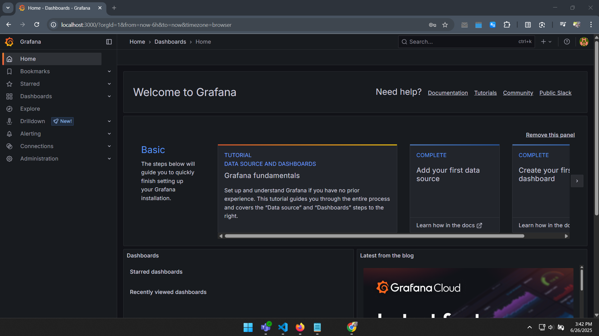
_Trang home của Grafana nè_

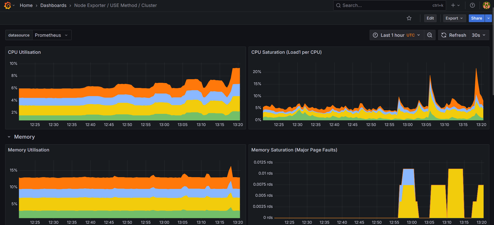
_Dashboard giám sát CPU, Memory các Node trong Cluster_

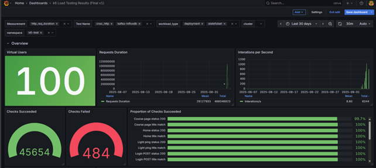
_Dashboard giám sát kiểm thử hiệu năng K6_

#### Prometheus

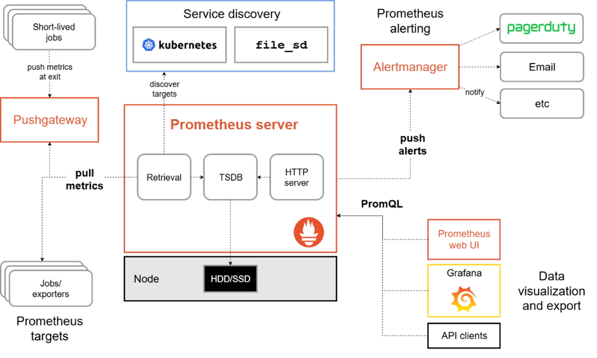

Là một hệ thống giám sát và cảnh báo mã nguồn mở. Nó được thiết kế để thu thập các chỉ số (metrics) theo thời gian thực từ các hệ thống được giám sát. Ở đầy thì Prometheus được sử dụng để thu thập các chỉ số hiệu năng của các thành phần hệ thống như CPU, memory, cũng như các chỉ số từ các bài kiểm thử K6 (giai đoạn đầu, sau này không dùng nữa).

#### Loki

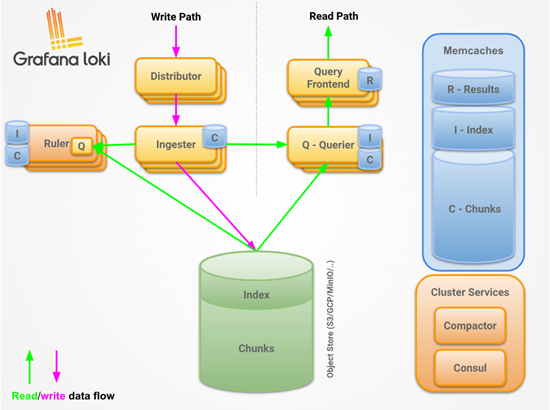

Là một hệ thống tổng hợp log (log aggregation) hoạt động giống như Prometheus, nhưng được tối ưu hóa cho log thay vì metrics. Nó giúp thu thập, lưu trữ và truy vấn các log từ các ứng dụng đang chạy trong cụm Kubernetes. Sử dụng Loki kết hợp với Grafana có thể dễ dàng tìm kiếm và phân tích log để phát hiện và khắc phục các vấn đề.

Loki có kiến trúc phân tán và được thiết kế để mở rộng một cách linh hoạt, thành phần gồm:

- **Distributor:** Nhận log từ các agent (ví dụ: Promtail, Fluentd, Fluentbit, Logstash…). Thực hiện việc xác thực (authentication), gắn nhãn (labels) và phân phối dữ liệu đến các Ingester.
- **Ingester:** Nhận log từ Distributor, chia dữ liệu thành chunks (khối dữ liệu nén) để tối ưu dung lượng. Lưu tạm trong bộ nhớ RAM và sau đó flush ra Object Store (S3, GCS, MinIO…) theo từng batch.
- **Query Frontend:** Tiếp nhận truy vấn từ người dùng (Grafana, API). Thực hiện query splitting và parallelization: chia nhỏ truy vấn để gửi đến nhiều Querier, tăng tốc độ xử lý, kết hợp caching kết quả để giảm tải hệ thống.
- **Querier:** Nhận yêu cầu từ Query Frontend và truy xuất dữ liệu từ Ingester (dữ liệu mới, chưa flush ra object store) hoặc Object Store (S3/MinIO – dữ liệu lưu trữ lâu dài), tổng hợp kết quả rồi trả về Query Frontend để hiển thị.
- **Ruler:** Thực hiện các alerting rules và recording rules tương tự như Prometheus. Ví dụ: tự động phát hiện lỗi bằng cách viết query để cảnh báo khi tần suất log error vượt ngưỡng.
- **Objec Storage:** lưu trữ dữ liệu lâu dài, có 2 định dạng chính được lưu:
- **Index (chỉ mục):** Lưu thông tin metadata (labels, stream ID, timestamp). Giúp hệ thống biết cần tìm dữ liệu ở đâu trong các chunk. Lưu trong Object Store (S3/MinIO) hoặc cơ sở dữ liệu như DynamoDB, BigTable, hoặc BoltDB-shipper.
- **Chunks (khối dữ liệu):** Chứa dữ liệu log đã được nén (snappy/gzip). Được flush từ Ingester ra Object Store. Mỗi chunk thường có kích thước ~1–2MB, giúp tối ưu I/O và chi phí.

**Khi có truy vấn:**

- Querier tra cứu Index để biết chunk nào cần đọc.
- Lấy chunk từ Object Store.
- Giải nén, lọc log theo query.
- Trả kết quả về Query Frontend và hiển thị lên Grafana.

---

### Công cụ hỗ trợ khác

#### InfluxDB

InfluxDB là một cơ sở dữ liệu time-series mã nguồn mở, được tối ưu để lưu trữ và truy vấn dữ liệu theo thời gian. Trên Kubernetes, InfluxDB thường được triển khai cùng với Telegraf để thu thập và lưu trữ các metrics hệ thống, ứng dụng, và logs. Trong hệ thống, InfluxDB được sử dụng làm nơi lưu trữ dữ liệu kiểm thử hiệu năng từ k6, giúp truy vấn và phân tích dữ liệu một cách hiệu quả.

#### Kafka

> Ở đây thì chúng tôi cài đặt và cấu hình Kafka Queue ở trước InfluxDB nha :v, vì khi kiểm thử hiệu năng lớn, việc chạy test được chia thành nhiều pod worker nhỏ chạy song song, lúc này dữ liệu kiểm thử được gửi đến InfluxDB là rất lớn, khiến cho InfluxDB không thể xử lý hết và hiển thị sai, thiếu dữ liệu thậm chí là ngừng hoạt động. Thế nên đặt một hàng đợi là Kafka trước InfluxDB để đảm bảo dữ liệu không bị gửi ồ ạt, không bị sót hay mất dữ liệu :>

Kafka là một nền tảng streaming phân tán mã nguồn mở, chuyên dùng để xử lý luồng dữ liệu theo thời gian thực. Khi triển khai trên Kubernetes (thường qua Strimzi Operator), Kafka hoạt động như một message broker trung gian, cho phép gửi và nhận dữ liệu theo mô hình publish/subscribe. Trong hệ thống, Kafka được sử dụng để truyền các metrics và logs từ k6 đến hệ thống thu thập dữ liệu, đảm bảo khả năng xử lý dữ liệu lớn, theo thời gian thực và mở rộng dễ dàng.

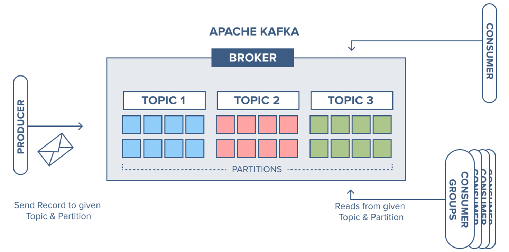

**Cấu trúc của Apache Kafka:**

- **Producer:** Thành phần gửi (publish) dữ liệu đến Kafka. Dữ liệu được ghi vào topic.
- **Topic & Partition:**
  - Topic: kênh (channel) nơi dữ liệu được phân loại.
  - Partition: mỗi topic chia thành nhiều phân vùng để tăng khả năng song song và mở rộng.
  - Mỗi partition là một log (append-only), các bản ghi được gắn offset.
- **Broker:** Máy chủ Kafka, lưu trữ dữ liệu và xử lý các request từ producer/consumer. Một cluster Kafka có nhiều broker để đảm bảo tính mở rộng và dự phòng.
- **Zookeeper** (trong Kafka 1.x – 2.x): Quản lý metadata, leader election cho partition. Từ Kafka 3.x trở đi, Zookeeper dần được thay thế bởi KRaft (Kafka Raft Metadata mode) – kiến trúc mới loại bỏ sự phụ thuộc vào Zookeeper.
- **Consumer & Consumer Group:**
  - Consumer: đọc dữ liệu từ topic/partition.
  - Consumer group: nhóm consumer chia nhau xử lý dữ liệu từ một topic. Mỗi partition chỉ được xử lý bởi một consumer trong group → giúp cân bằng tải.
- **Replication:**
  - Mỗi partition có thể có nhiều bản sao (replica).
  - Một replica được chọn làm leader, còn lại là follower để dự phòng.
  - Nếu leader hỏng, một follower được bầu lên làm leader mới.

#### Telegraf

Telegraf là một agent thu thập dữ liệu mã nguồn mở do InfluxData phát triển. Nó có kiến trúc dựa trên plugin, hỗ trợ thu thập metrics từ hệ thống, ứng dụng, container, và Kubernetes. Telegraf có thể chạy dưới dạng DaemonSet hoặc sidecar trên cluster để tự động thu thập thông tin. Trong hệ thống này, Telegraf được sử dụng để lấy metrics từ Kafka, Kubernetes và các thành phần khác, sau đó đẩy vào InfluxDB để phục vụ việc lưu trữ và phân tích.

---

### Quản lý lưu trữ

#### Longhorn

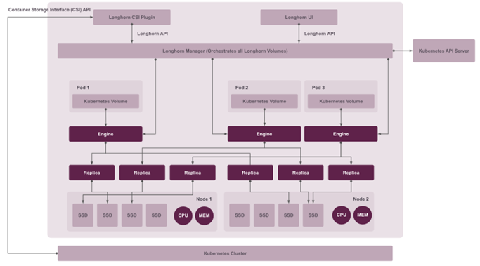

Longhorn là một giải pháp lưu trữ phân tán mã nguồn mở, được phát triển bởi Rancher. Longhorn cung cấp Persistent Volume với dung lượng tùy chỉnh để lưu trữ bền vững và chịu lỗi cao bằng cách sao chép dữ liệu trên nhiều node (lưu ý nhé). Nó sử dụng công nghệ iSCSI để tạo các volume, cho phép Pod trên bất kỳ node nào trong cụm truy cập vào dữ liệu một cách nhất quán. Longhorn cũng cung cấp dashboard trực quan để giám sát dương lượng trống trên các node và tình trạng các Volume, thuận tiện cho việc quản lý ổ đĩa. Để triển khai Longhorn, cụm cần có ít nhất 3 node và mỗi node phải có ổ đĩa trống để Longhorn quản lý.

#### MinIO

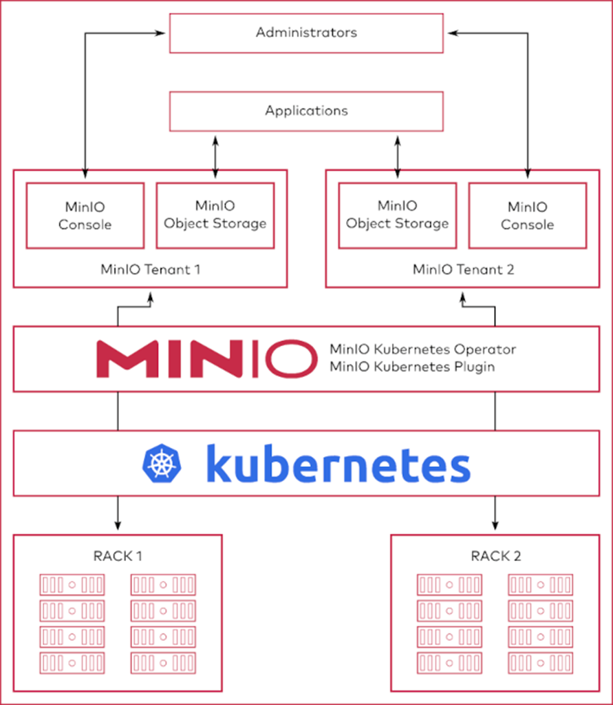

MinIO là một máy chủ lưu trữ đối tượng (object storage) mã nguồn mở, tương thích với API của Amazon S3. Trong hệ thống này, MinIO được sử dụng để lưu trữ dữ liệu của WordPress và InfluxDB v2. Mục đích của MinIO là cung cấp một giải pháp lưu trữ hiệu quả, có thể mở rộng cho các đối tượng dữ liệu lớn, giúp dễ dàng truy cập và quản lý kết quả kiểm thử một cách tập trung.

---

### HA Application

> Cái này thì tôi và cậu ấy triển khai WordPress với MariaDB, truy vấn từ người dùng sẽ đến Nginx Ingress Controller trước rồi mới chuyển tiếp tới các pod WordPress, WordPress được cấu hình nhiều pod để chịu lỗi và có khả năng auto-scale khi số lượng request lớn :> WordPress xử lý request rồi gọi MariaDB nếu cần, trước MariaDB thì cũng có ProxySQL để caching và phân phối SQL request giúp giảm tải, tối ưu thời gian xử lý, MariaDB này cài đặt ở dạng Cluster (MariaDB Galera) với 1 pods master read/write và 2 pods slave read để đảm bảo đồng bộ dữ liệu ghi vào mà vẫn xử lý song song các dữ liệu đọc ra. Hong có sơ đồ cụ thể nhưng mà mọi người có thể tham khảo hình này hoặc search với keyword **"High Availability Web/App design and deployment best practice"**.

## Khó khăn và cách giải quyết

> Con đường nào mà chẳng có chông gai, quan trọng là ý chí của mình và cách mình vượt qua đúng không nào ~

1. Vấn đề tài nguyên

   Ờ thì lúc đầu chúng tôi cài đặt K8s ở Local, tuy nhiên cài đặt thì được chứ chạy thì không `⊙﹏⊙∥`. Mỗi lần chạy test cái là đứng máy luôn, huhu. Lúc đầu tôi cũng chưa biết giải quyết sao, nhưng mà lúc báo cáo với Sếp thì anh nói để anh cấp máy ảo để SSH tới sử dụng, và hỏi tôi sao không đủ tài nguyên mà không báo sớm, cần cho công việc thì cứ nói với anh. Lúc đó nhẹ nhõm hẳn, do chưa quen mọi người với cũng không biết có quyền xin cấp máy ảo nên chúng tôi không dám hó hé gì :v Nên là mọi người có thực tập thì cứ mạnh dạn hỏi, đề xuất với người hướng dẫn nha.

2. Vấn đề phân quyền

   Mọi người còn nhớ chỗ chúng tôi nói được cấp quyền Cluster Owner trong K8s chứ? Chà, thật sự thì đáng lẽ intern chỉ có quyền là Developer thôi, và sẽ bị hạn chế với một số tác vụ, tuy nhiên lúc cài đặt Testkube thì cần phải cài đặt CRDs (Custom Resource Definition) và cái này cần có Cluster Role - quyền quản lý Cluster :v Sau khi trình bày thì anh Sếp quyết định tạo một cluster mới cho chúng tôi và cấp luôn Cluster Owner, haha. Nhưng mà chỉ thao tác qua Rancher Dashboard thôi, các Node trong cluster muốn thao tác vẫn phải thông qua sếp và anh Cluster Admin thật sự :>

3. Vấn đề Teamwork

   Cái này thì do chúng tôi có làm nhóm với một bạn nữa, cơ mà chẳng may bạn ấy phải nằm viện hết vài tuần :v cơ mà do trước đó chúng tôi không đồng bộ công việc với nhau, mỗi người một việc nên thành ra lúc nhận việc của bạn đó thì tôi tốn khá nhiều thời gian để nắm được, sau khi bạn đó trở lại thì cũng phải tốn khá nhiều thời gian để đồng bộ với nhau. Mọi người khi làm việc nhóm nếu được thì trò chuyện với thành viên trong nhóm nhiều hơn để nắm bắt khó khăn và tiến độ của thành viên nha, nếu được thì họp định kỳ để đồng bộ công việc với nhau, đảm bảo mọi người đều hiểu được công việc của nhau và có thể giữ vững tiến độ dù có thêm hay bớt thành viên. Và cân nhắc năng lực của thành viên mà chia việc cho hợp lý nha :>

4. Vấn đề kỹ năng, kiến thức

   Chà, thời này mà không dùng AI thì xứng đáng được bảo tồn đó chứ. Nói thế chứ dùng AI cũng phải tùy việc mọi người ạ, ví dụ như lúc đầu đọc document các công cụ cần triển khai, chúng tôi đều đưa cho GPT, Gemini, Grok... tóm tắt và xử lý hết, tiết kiệm thời gian đấy nhưng mà chẳng có cái nào dùng được cả, tại nó không đúng template hoặc là version không khớp. Mọi người chỉ nên nhờ nó tìm thôi, còn mình thì vẫn phải tự đọc mới được. Hoặc ví như việc viết kịch bản test, do lúc trước chỉ học sơ sơ mấy cái JavaScript trong môn Lập trình ứng dụng Web nên tôi và cậu ấy cũng không nắm rõ cú pháp, chức năng. Nhờ GPT làm thì cũng được thôi, nhưng mà phải hiểu script đang làm gì nhé, chứ không sếp mà kêu tùy chỉnh mà lại mở GPT lên thì ba chấm lắm đó. Cái này mọi người có thể nhờ AI hỗ trợ syntax, function, cấu trúc chương trình các thứ, chứ đừng để AI làm hết, mọi người cần nắm được input, output và quá trình xử lý (ý tưởng hoặc luồng xử lý chi tiết) còn lại thì có thể dùng AI, sửa script nhiều rồi cũng tự động quen syntax, cú pháp thôi :v

## Ngày cuối cùng

> 3 tháng thực tập thế chứ nhanh lắm mọi người ạ, nhắm mắt cái là hết rồi, cũng như 4 năm đại học vậy. Ngày cuối cùng thì buổi sáng chúng tôi được chị HR hỗ trợ làm phiếu xác nhận thực tập luôn. Đến trưa thì đi ăn cũng team thực tập rồi mua bó hoa để chiều tặng cho Trung tâm (Sếp đại diện nhận). Công việc lúc đó thì tôi cũng hoàn thành gần hết rồi, chỉ là triển khai cái Website WordPress xong rồi nhưng mà chưa thử nghiệm hết :v Nhưng mà anh Sếp bảo vậy cũng được nên không sao, hehe. Hôm đấy thì có anh bên team Dev mời nước mọi người nữa :3 quá đã. À, ở trung tâm thì mấy anh chị hay mời bánh, trái cây và nước lắm, nên đi thực tập được ăn uống quá trời luôn :33 hehe. Mọi người ai cũng vui vẻ, thân thiện hết, làm việc rất thoải mái luôn. Anh Sếp thì hơi ít nói nhưng hay động viên lắm, với hễ cần gì là ảnh nói mấy anh chị hỗ trợ liền, còn có mấy lần chúng tôi làm sập hệ thống nữa nhưng mà ảnh không trách mắng gì, chỉ hỏi chúng tôi biết nguyên ngân và cách khắc phục không để ghi vào báo cáo thôi. Ngoài ra, trong lúc thực tập thì may mắn được làm gương mặt quảng bá cho Trung tâm nữa, haha, mọi người có theo dõi chắc cũng thấy tôi và cậu ấy lên hình kha khá nhỉ.\
> \
> Hehe, bài dài quá trời gòi, cám ơn mọi người vì đã đọc đến tận đây nha :3 Tạm biệt và hẹn gặp lại.
