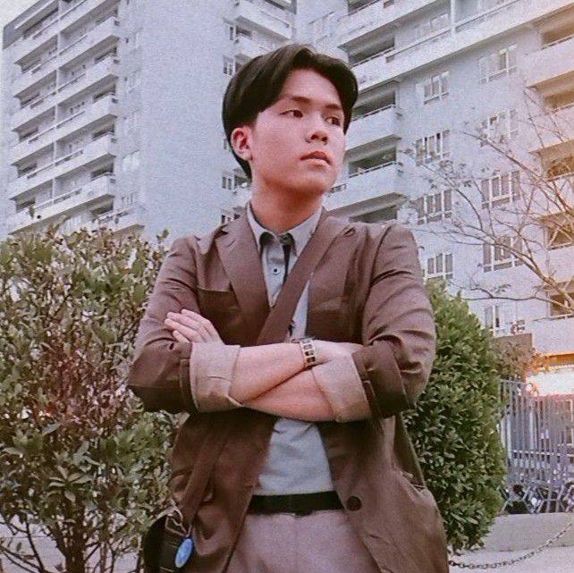
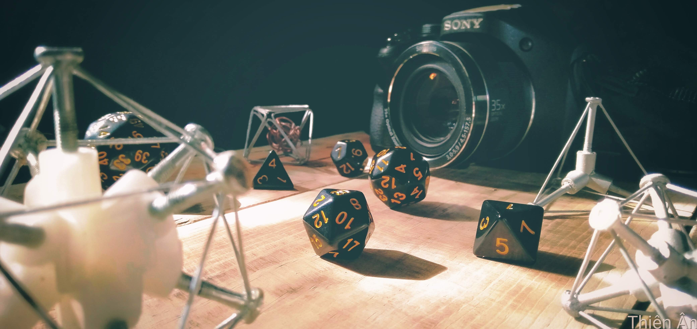
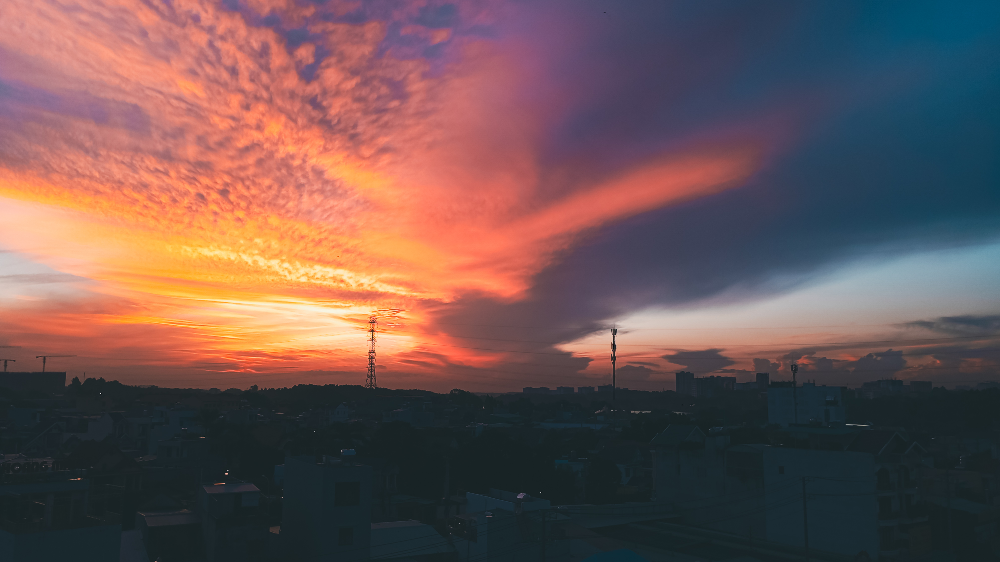
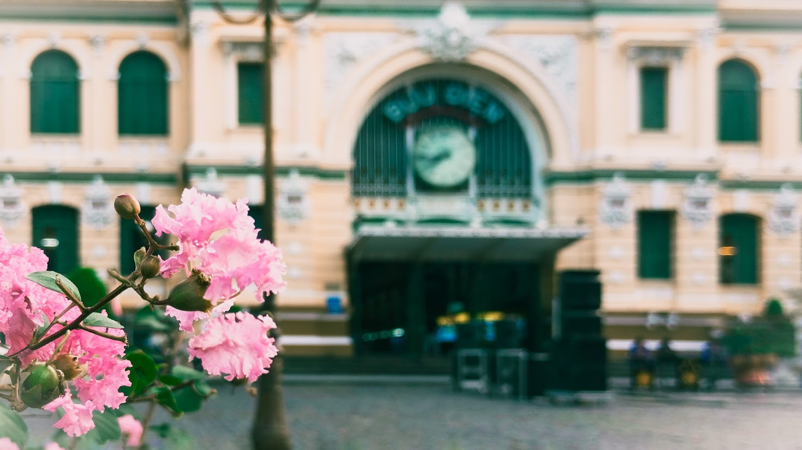
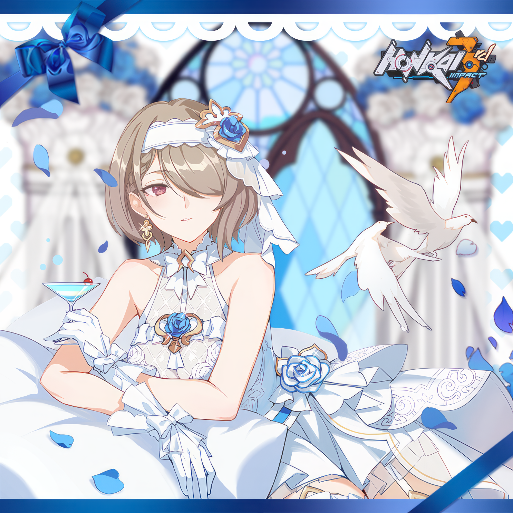
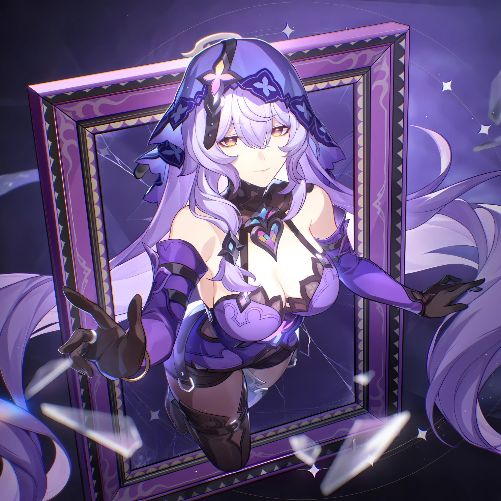
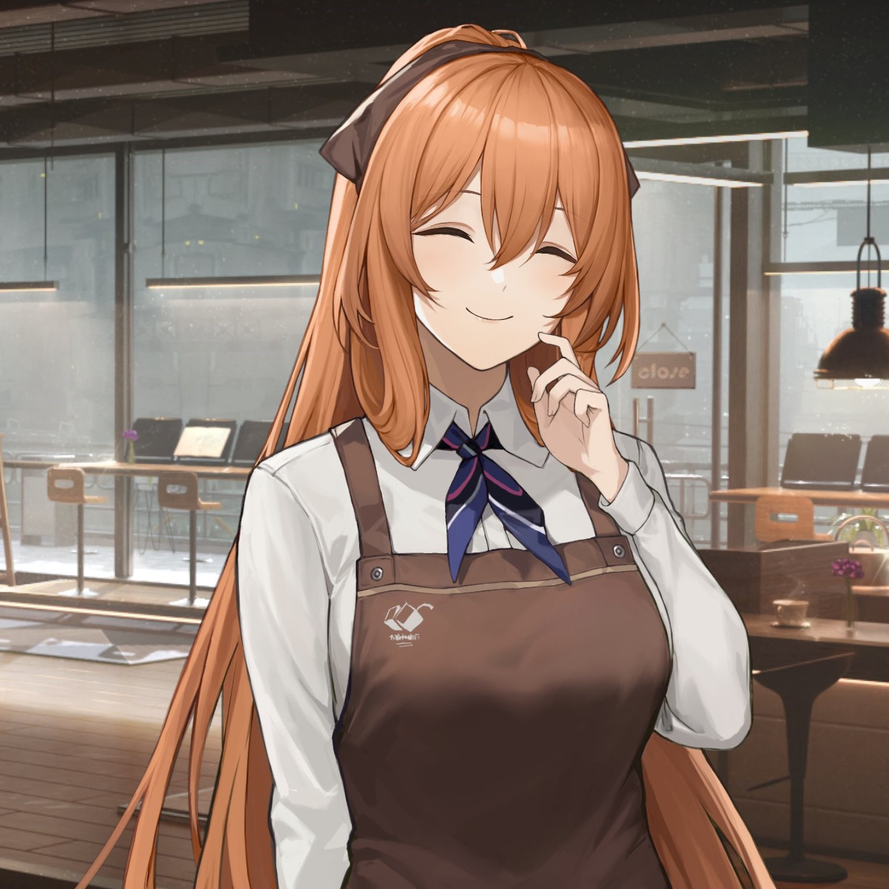

# Hi, I'm a little Whale 🐳

## About Me 📝

| I am a **third-year Information Security student**, passionate about building secure network applications and solving cybersecurity challenges. My near goal is to be an intern in the **SOC Tier 1** position, further I hope I can graduate on time and get a job in the Blue team. |  |
| ------------------------------------------------------------------------------------------------------------------------------------------------------------------------------------------------------------------------------------------------------------------------------------- | ----------------------------------------- |

### Topics of interest

- I still have a lot to learn and practice, especially in cybersecurity. Currently I am researching about topics such as **IPS/IDS**, **SOC Analyst** and **Threat Intelligence**. I would be happy if you could share with me your knowledge on this topic.

### Skills

- **Programming**: `C++`, `Python`, `Assembly Intel x86`
- **Tools**: `Nmap`, `Wireshark`, `GDB`, `pwntools`, `Nessus`, `Suricata`, `OSSEC`
- **English**: TOEIC LR 690, TOEIC SW 280. Able to read and understand documents, scientific articles, write emails and essays as well as communicate at a basic level.

## Projects 🚀

| **Project**                                  | **Description**                                                                                            | **Teammates**                          | **Role**    | **GitHub**                                       |
| -------------------------------------------- | ---------------------------------------------------------------------------------------------------------- | -------------------------------------- | ----------- | ------------------------------------------------ |
| **Network Scanner**                          | Built a multi-functional scanner for network analysis.                                                     | Huu Binh, Phuong Dai, Cong Danh        | Contributor | [View Code](https://github.com/fuondai/Adab_net) |
| **Obfuscator and Clone Code Detector**       | Read, research, and reproduce the [article](https://link.springer.com/article/10.1186/s42400-023-00148-x). | Huu Binh, Phuong Dai, Cong Danh        | Leader      | -                                                |
| **Active Directory Domain Services (AD DS)** | Learned how to manage users and data in domains, tested configuration on VMware.                           | Huu Binh, Cong Danh, Huynh Do Thien An | Contributor | -                                                |
| **Personal Blog Website**                    | Created a simple blog website using Docusaurus.                                                            | -                                      | Creator     | -                                                |

## Experience 💼

- I wonder what I should write here?

## Contact 📧

- **Email**: [22520028@gm.uit.com](mailto:22520028@gm.uit.com)
- **Phone**: [082 627 4939](tel:0826274939)
- **GitHub**: [ThienAnUIT2022](https://github.com/ThienAnUIT2022)
- **Facebook**: [anotherLittleW](https://www.facebook.com/anotherLittleW/)

# And... I'm another little Whale 🐋

## About another me 🌟

What do you think of the little whale above **(・・ )?** Yeah, that’s a whale who studies and works, is quite serious and often worries about the future **(´･ᴗ･ `)**.
_Be careful, I’m going to talk a lot !_ **(☆ω☆)**
As for me **( ˙꒳​˙ )**, I’m a whale who swims in the clouds full of dreams, I pursue my passion and interests to nourish my soul **(っ ˘ω˘ς )**. I like quiet and peaceful places **(´꒳`)♡**, away from crowded and noisy places **(￣ ￣|||)**. I like to spend my days off at home cooking, making coffee, reading manga and listening to soft music **(´,,•ω•,,)♡**.

## Hobbies 🎨

### Photography 📸

- I extremely love taking pictures **(≧ω≦)**! I take pictures not only to capture moments but also to show people how I see the world. My style is photos that have an "artistic" perspective or at least something special that I think is beautiful. Also, the colors in my photos are mostly warm and washed out, like 90s film. You can see my albums below **(>ᴗ•)**:

| [**Express my style**](https://photos.app.goo.gl/4GTPRujA9zrrcCUm7)        |  |
| -------------------------------------------------------------------------- | --------------------------------------------- |
| [**Sunset, sunrise and sky**](https://photos.app.goo.gl/agoiGqvec9zY8Ryr7) |   |
| [**Little things**](https://photos.app.goo.gl/Kd4wNjfe21ocNhZA7)           |   |

### Anime, Manga, Light Novel, Game 🎮

- Hmmm, I read and watch a lot of Japanese anime, manga and light novels, my friend and someone call me "wibu" or "otaku" [(=^･ω･^=)]. The games I play are usually games with similar art style to anime and manga including **Honkai Impact 3rd** (played the most), **Honkai Star Rail**, **Girl's Frontline 1 & 2**.

|  |  |  |
| ------------------------------------------- | ------------------------------------------- | ------------------------------------------ |

### Music 🎵

I listen to many different genres of music and usually according to the time of day or my mood. For example, according to the time, in the morning I will listen to dynamic Jazz like in coffee shops, in the afternoon I often listen to gentle Piano and in the evening it will be melodious, soulful Saxophone and Violin [(っ ˘ω˘ς )]. Some singers that I like and listen to regularly are:

- **Vietnamese**:

  - [Hà Anh Tuấn](https://open.spotify.com/artist/3FwYnbtGNt8hJfjNuOfpeG?si=ZMRAxw5mRTyzI0KipYcVQQ)
  - [Đen Vâu](https://open.spotify.com/artist/1LEtM3AleYg1xabW6CRkpi?si=P9neKjJORrSzMzdN9DG1UQ)
  - [Vũ.](https://open.spotify.com/artist/57g2v7gJZepcwsuwssIfZs?si=YW_EbcrVRvyiloqYhd9eAw)
  - [Phạm Hồng Phước](https://open.spotify.com/artist/2DpuPZSraeVoLMKV5QJj7y?si=fPOvGN21R3mCw3AfZhyAAA)
  - [Phan Mạnh Quỳnh](https://open.spotify.com/artist/0aNyWetkjBvIdZvJY00yEa?si=jyhxXkXsQJOBiEqN2Gea8Q)
  - [Táo](https://open.spotify.com/artist/23xCr75lKvnFvKi8ImHE7S?si=VUG0SvfoRPmQxy2Ccz-WZw)
  - [N.H.A](https://open.spotify.com/artist/0y8J897IGMESNbBqCpHXH9?si=2AjTbQleQzitXwUGaZue2Q)
  - [Taynguyensound](https://open.spotify.com/artist/5ayWRfrcpObgDDlzheJ2Gr?si=yzjBh7nmSFe1Zi07p9fwAQ)
  - [buitruonglinh](https://open.spotify.com/artist/7Cp2hGcriAaDUAWpXnSEwm?si=mUzlxJH_QrGNhVLvTBu3bQ)
  - [Quất Điền](https://open.spotify.com/artist/60tTfNCdp802Z5ot9BD8BL?si=-ZyznhCbT7GZ20RMw5ivhg)

- **Japanese**:

  - [Aimer](https://open.spotify.com/artist/0bAsR2unSRpn6BQPEnNlZm?si=aAcXeuSjSdmZ2B2Fjz7CZw)
  - [Uru](https://open.spotify.com/artist/6le80R1opKnTlP4o3KvA2k?si=X1S2RN3rT_GVmhUBDK35nA)
  - [LiSa](https://open.spotify.com/artist/0blbVefuxOGltDBa00dspv?si=i5JDPw5rSfCQLWDY6s8vRw)
  - [Lilas Ikuta](https://open.spotify.com/artist/1qM11R4ylJyQiPJ0DffE9z?si=pvWCsWnrTtG1LrEV6Sqi1g)
  - [milet](https://open.spotify.com/artist/45ft4DyTCEJfQwTBHXpdhM?si=vKIJT2O8TQGLmbfCe6FHIw)
  - [MYTH&ROID](https://open.spotify.com/artist/1NRrtMvT3o1TI6I8XCuweq?si=ChXmpz4lQRKnI7cCwPevNg)
  - [FLOW](https://open.spotify.com/artist/3w2HqkKa6upwuXEULtGvnY?si=nasvWiomShaJqWAuUqWKzQ)
  - [back number](https://open.spotify.com/artist/6rs1KAoQnFalSqSU4LTh8g?si=8vfzKGZhSKWeBdjQbSUo-A)
  - [HOYO-MiX](https://open.spotify.com/artist/2YvlK6lKiKVjXxsjvNbnqg?si=EFCh3k84Q3aQB_n4ZoNNhA)
  - [Vanguard Sound](https://open.spotify.com/artist/5A1EDnSFUMMfYX6XMBFNj6?si=wYUX1pXdQc6Xibj14LRYxg)
  - [Ayasa](https://open.spotify.com/artist/2Vw8ZOGpNopFlzMialk6LN?si=gKPKc0S5Req2fy49Ip-Cig)
  - And some songs: [Ride on time](https://open.spotify.com/track/78032GHRcUBBCFxpRBQcnH?si=c102e6d585f649b4), [Plastic Love](https://open.spotify.com/track/7rU6Iebxzlvqy5t857bKFq?si=939c8226aa724b65)

- **US-UK**:

  - [Keane](https://open.spotify.com/artist/53A0W3U0s8diEn9RhXQhVz?si=7udsanpmSryDAU8bXGwGIw)
  - [Imagine Dragons](https://open.spotify.com/artist/53XhwfbYqKCa1cC15pYq2q?si=Z50qK021TmyU_lgoLb4x9g)
  - [Sia](https://open.spotify.com/artist/5WUlDfRSoLAfcVSX1WnrxN?si=wx7LEvw3Sm-wAoav73PiPg)
  - [Tom Odell](https://open.spotify.com/artist/2txHhyCwHjUEpJjWrEyqyX?si=3hPeJyuKRhO4Unc_2NWy9g)
  - [Charlie Puth](https://open.spotify.com/artist/6VuMaDnrHyPL1p4EHjYLi7?si=7IK6pHhjR664nvzwtSkMVQ)
  - [Stephen Sanchez](https://open.spotify.com/artist/5XKFrudbV4IiuE5WuTPRmT?si=wQ6BAFbQTii783SiIwECpg)
  - [Backstreet Boys](https://open.spotify.com/artist/5rSXSAkZ67PYJSvpUpkOr7?si=qo-3nv4kRfGtrVzPr0NMqw)
  - [The Beatles](https://open.spotify.com/artist/3WrFJ7ztbogyGnTHbHJFl2?si=X5-8F5aCRo-Z-v68XU91gA)
  - [Modern Talking](https://open.spotify.com/artist/79bxUQsBIXO8nVLB9fYKf7?si=3HsfcU0YTxuXIiZkI9eYcQ)

- **Chinese**: I only listen to a [playlist](https://open.spotify.com/playlist/46zSNsov21rnxMZVbFZjzA?si=1d0558c753a347bd), or individual songs, not artists **(・–・;)ゞ**.

### Making coffee, cook and do crafts ☕🍳✂️

- I can say that I drink coffee instead of water every day :b, because every morning when I wake up and in the evening I will drink a cup of coffee (2 cups/day), sometimes when I lack sleep I will drink more. I will not have a day of alertness without a drop of coffee that day **( ╹▽╹ )**.
- I'm not very good at cooking, but I enjoy the process of preparing, cooking and enjoying the food I make. I also often cook for my friends and am happy when they say it's delicious **(´꒳`)♡**.
- When I was young, I had a lot of free time and my mother had an Origami book so I folded them a lot **(￣ ▽ ￣)ゞ**, gradually it became a hobby, whenever I had free time I would make them. I quite like regular polyhedra so I also found ways to make them for decoration, to make flower pots, to make desk calendars...etc. Besides, I like giving gifts to friends so I often make small gifts for them, sometimes I also wrap flowers myself.

_Well, Did you really read this far **Σ( ° △ °|||) ?** A-A-Are you interested in me **(⁄ ⁄•⁄ω⁄•⁄ ⁄)** Just kidding, ehehe :b. Anyway, thank you for taking the time to read this, have a nice day~._
