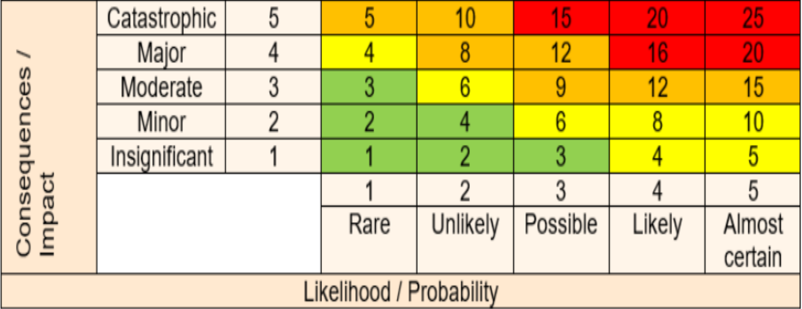

## 1. Khái quát chung

- Quy trình QLRR phải tuân theo các nguyên tắc (Chương 3) và khuôn khổ QLRR (Chương 4).
- Phải áp dụng hệ thống chính sách, quy trình, thủ tục của doanh nghiệp.
- Triển khai theo chu trình **PDCA**:

  - **P**lan: Trao đổi, thiết lập bối cảnh, đánh giá rủi ro
  - **D**o: Xử lý rủi ro
  - **C**heck: Theo dõi và xem xét
  - **A**ct: Cải tiến, lập hồ sơ, báo cáo

---

## 2. Trao đổi thông tin & Tham vấn (Communication & Consultation)

- Mục đích: Hỗ trợ ra quyết định; cung cấp đầy đủ thông tin cho các bên liên quan.
- Phải có quy trình giao tiếp hai chiều, minh bạch và kịp thời trong suốt quy trình QLRR.

---

## 3. Phạm vi - Bối cảnh - Tiêu chí (Scope - Context - Criteria)

### 3.1 Xác định phạm vi

- Xác định hoạt động, dự án, mục tiêu, đối tượng áp dụng
- Xác định thời gian, địa điểm, công cụ, nguồn lực

### 3.2 Bối cảnh

- **Nội bộ**: Tầm nhìn, sứ mệnh, cấu trúc, chiến lược, văn hóa
- **Bên ngoài**: Kinh tế, chính trị, xã hội, công nghệ, môi trường, pháp lý

### 3.3 Tiêu chí rủi ro

- Xác định các mức độ rủi ro chấp nhận/đặt giới hạn
- Tiêu chí gồm 2 yếu tố: **khả năng xảy ra** và **mức độ hậu quả**
- Xây dựng **ma trận rủi ro** (Risk Matrix) 5x5 hoặc 6x6

---

## 4. Đánh giá Rủi ro (Risk Assessment)

### 4.1 Nhận diện rủi ro (Risk Identification)

- Tìm rủi ro có thể ảnh hưởng tới mục tiêu
- Sử dụng: danh mục tài sản, phụ lục A ISO 27001, phân tích gốc rễ, kiểm toán, phỏng vấn, thảo luận...

### 4.2 Phân tích rủi ro (Risk Analysis)

- Xem xét sự không chắc chắn, nguồn rủi ro, hậu quả, kịch bản, điểm yếu, kiểm soát hiện tại...
- Áp dụng: định tính, định lượng, hoặc kết hợp

### 4.3 Định mức rủi ro (Risk Evaluation)

- So sánh với tiêu chí để ra quyết định:

  - Giữ nguyên
  - Xử lý thêm
  - Tăng kiểm soát
  - Thay đổi chiến lược

---

## 5. Xử lý Rủi ro (Risk Treatment)

- Lựa chọn và triển khai biện pháp xử lý:

  - Tránh rủi ro (không làm, dừng hoạt động)
  - Chấp nhận rủi ro
  - Giảm rủi ro (giảm khả năng hoặc hậu quả)
  - Chuyển giao rủi ro (mua bảo hiểm, hợp đồng)

- Xây dựng kế hoạch xử lý rủi ro và theo dõi triển khai

---

## 6. Theo dõi và Xem xét (Monitoring and Review)

- Mục đích: Đảm bảo chất lượng và hiệu lực của toàn bộ quy trình QLRR
- Theo dõi liên tục, xem xét định kỳ theo chu kỳ
- Báo cáo kết quả xem xét gửi cho cấp lãnh đạo

---

## 7. Lập hồ sơ và Báo cáo (Recording and Reporting)

- Ghi lại toàn bộ quy trình:

  - Phân tích
  - Đánh giá
  - Quyết định
  - Kế hoạch xử lý

- Báo cáo rõ ràng, minh bạch, đủ thông tin cho các bên liên quan
